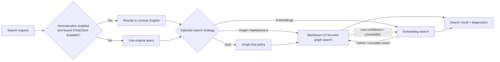

# ADR-0002: Search Ranking And Query Normalization

Status: Updated by ADR-0005 
Date: 2026-04-15 
Superseded parts: the former standalone tokenizer strategy and lexical fallback are removed.

## Context

`ManagedCode.MCPGateway` must stay useful when a host does not register embeddings, while still taking advantage of embeddings when the host explicitly opts into them. The package also needs to handle multilingual, typo-heavy, and weakly specified queries without degenerating into hardcoded phrase lists.

Earlier versions used a local tokenizer-backed ranking pipeline for deterministic non-vector retrieval. ADR-0005 replaces that standalone tokenizer path with Markdown-LD focused graph search from `ManagedCode.MarkdownLd.Kb`. Token-distance behavior still exists, but it is owned by the Markdown-LD graph library and is no longer exposed as `McpGatewaySearchStrategy.Tokenizer`.

This decision record now documents the stable query-normalization policy and the search strategy boundaries after the Markdown-LD graph change.

## Decision

`ManagedCode.MCPGateway` will use `SearchStrategy.Graph` as the default production mode. Optional English query normalization remains available through a keyed `IChatClient` before ranking. Vector search remains available only when the host chooses `SearchStrategy.Embeddings` or explicitly chooses `SearchStrategy.Auto`.

The gateway will also treat `McpGatewaySearchMatch.Score` as a gateway-owned confidence value, not as a raw backend rank. Graph-library ranks must be calibrated against descriptor/query evidence before they are returned to callers so clearly weak multilingual or noisy matches do not surface with fake perfect confidence.

Search modes:

- `Graph` / `MarkdownLd`: default deterministic local graph retrieval using `ManagedCode.MarkdownLd.Kb`
- `Embeddings`: vector ranking first, Markdown-LD graph fallback when vector query generation fails or returns an unusable vector
- `Auto`: graph-first policy mode that keeps graph canonical and performs semantic vector rescue/merge only when graph confidence is low or graph search is unavailable

## Diagram

## Alternatives

### Alternative 1: Embeddings only

Pros:

- simple ranking story
- potentially higher semantic quality when embeddings are always available

Cons:

- unusable in zero-embedding hosts
- adds a hard external dependency for a core package feature

### Alternative 2: Keep a separate tokenizer strategy

Pros:

- preserves the previous deterministic fallback path
- avoids graph indexing cost for hosts that only want token scoring

Cons:

- creates three user-visible retrieval modes when the intended product choice is embeddings versus Markdown-LD graph
- duplicates token-distance search already provided by `ManagedCode.MarkdownLd.Kb`
- keeps legacy runtime code and test fixtures alive after graph search replaces them

### Alternative 3: Improve search with hardcoded synonym or phrase lists

Pros:

- quick tactical gains for a few known queries
- easy to demo

Cons:

- brittle and domain-specific
- violates the repository rule to prefer mathematical ranking improvements over query text hacks
- scales poorly across languages and noisy inputs

## Consequences

Positive:

- the default search path works without embeddings or a chat model
- optional English normalization improves multilingual/noisy inputs without making the package depend on an AI client
- graph-focused search can return primary matches plus related and next-step expansion matches
- callers receive a more trustworthy confidence signal for multilingual and typo-heavy graph queries
- `Auto` can rescue low-confidence graph results with semantic vector matches without changing the default `Graph` mode
- vector ranking stays available for hosts that explicitly configure it

Trade-offs:

- graph indexing is heavier than the removed local tokenizer pipeline
- multilingual quality without a normalizer still depends on the graph corpus and Markdown-LD token-distance behavior
- documentation must clearly distinguish default graph mode from opt-in embedding mode

Mitigations:

- keep graph behavior deterministic and covered by local tests
- keep README examples for graph, embedding, auto, file-backed graph, and optional normalization deployments
- keep query normalization keyed and optional so hosts control model/provider cost

## Invariants

- `SearchStrategy.Graph` MUST remain the default search strategy.
- `SearchQueryNormalization` MUST default to `TranslateToEnglishWhenAvailable`.
- The package MUST NOT expose stale tokenizer-choice options or a separate local `Tokenizer` strategy.
- If no embedding generator is registered, search MUST still function through Markdown-LD graph ranking.
- If vector search fails for a request, the gateway MUST fall back to Markdown-LD graph ranking and emit diagnostics instead of failing the request.
- If English normalization is enabled but no keyed `IChatClient` is registered, search MUST continue with the original query.
- `McpGatewaySearchMatch.Score` MUST remain a calibrated confidence value, not a raw graph-library rank.
- Clearly weak graph matches MUST NOT surface with `Score = 1` only because they were the best relative graph hit.
- `Auto` MUST run graph search first when graph search is available and MUST use vector ranking only as a low-confidence semantic rescue or when graph search is unavailable.
- Search-quality improvements MUST prefer mathematical or graph-ranking changes over hardcoded phrase exceptions.

## Rollout And Rollback

Rollout:

1. Keep README defaults aligned with `SearchStrategy.Graph`, `SearchQueryNormalization`, and the top-5 default result size.
2. Keep `McpGatewayServiceKeys.SearchQueryChatClient` documented as the optional keyed normalizer dependency.
3. Keep graph tests current with generated and file-backed graph sources.
4. Keep confidence-calibration tests for multilingual, typo-heavy, and weak-intent graph queries.

Rollback:

1. Reintroduce a public tokenizer-selection option only if there is a concrete product requirement and a supported compatibility story.
2. Disable normalization by default only if the package intentionally stops preferring English retrieval convergence for multilingual or noisy inputs.

## Verification

- `dotnet restore ManagedCode.MCPGateway.slnx`
- `dotnet build ManagedCode.MCPGateway.slnx -c Release --no-restore`
- `dotnet build ManagedCode.MCPGateway.slnx -c Release --no-restore -p:RunAnalyzers=true`
- `dotnet test --solution ManagedCode.MCPGateway.slnx -c Release --no-build`
- `dotnet tool run roslynator analyze src/ManagedCode.MCPGateway/ManagedCode.MCPGateway.csproj tests/ManagedCode.MCPGateway.Tests/ManagedCode.MCPGateway.Tests.csproj`
- `cloc --include-lang=C# src tests`

## Implementation Plan

1. Keep `McpGatewayOptions` defaults aligned with the intended production behavior.
2. Keep the optional keyed English query normalizer behind `McpGatewayServiceKeys.SearchQueryChatClient`.
3. Keep Markdown-LD graph ranking deterministic, diagnostic-friendly, and covered by generated/file-backed tests.
4. Keep README examples for graph, file-backed graph, auto, embeddings, and optional normalization scenarios.

## Stakeholder Notes

- Product: the package has one recommended free default and an explicit paid/host-provided embedding option.
- Dev: search quality work should continue through graph construction, statistical scoring, and evaluation data, not manual phrase hacks.
- QA: typo, multilingual, weak-intent, graph expansion, and file-backed graph scenarios are required test coverage.
- DevOps: hosts can run fully local graph search or add keyed chat/embedding services when needed.
