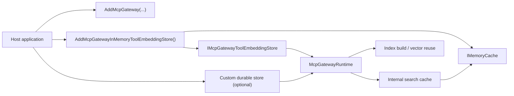

# ADR-0004: Process-Local Embedding Store Uses IMemoryCache

## Context

`ManagedCode.MCPGateway` exposes `IMcpGatewayToolEmbeddingStore` so hosts can reuse tool embeddings between index builds.

The package still needs built-in process-local caching for two different concerns:

- tool-embedding reuse between index builds
- ephemeral runtime reuse for normalized queries, query embeddings, and exact repeated search results

Horizontal scale, durability, and cross-replica cache coherence remain separate concerns.

## Decision

The built-in `McpGatewayInMemoryToolEmbeddingStore` will use `IMemoryCache` for process-local embedding reuse, and the package will expose a dedicated `AddMcpGatewayInMemoryToolEmbeddingStore()` registration path that wires the store to the host's shared cache services.

The gateway runtime will also use an internal typed cache service backed by the same host `IMemoryCache` registration for ephemeral search-path reuse. That internal cache may store normalized queries, query embeddings, and exact repeated search results, but it must stay process-local and must not replace the durable `IMcpGatewayToolEmbeddingStore` abstraction.

Durable or distributed embedding reuse will remain the responsibility of host-provided `IMcpGatewayToolEmbeddingStore` implementations.

## Diagram

## Alternatives

### Alternative 1: Ship no built-in process-local embedding store

Pros:

- smallest core package surface
- no opinionated local cache behavior

Cons:

- worse onboarding for hosts that only need local embedding reuse
- forces boilerplate for a very common optional scenario

### Alternative 2: Make the built-in store durable or distributed

Pros:

- stronger scaling story out of the box
- state can survive process restarts

Cons:

- introduces infrastructure and configuration assumptions into the core package
- forces dependency choices that belong to the host
- conflicts with the package goal of keeping embedding persistence optional

### Alternative 3: Depend directly on distributed cache abstractions in runtime code

Pros:

- shared cache behavior is explicit in the package internals
- less host code for cache-backed multi-instance deployments

Cons:

- couples gateway runtime code to a specific cache family
- weakens the current abstraction boundary around `IMcpGatewayToolEmbeddingStore`
- makes single-instance local reuse heavier than necessary

## Consequences

Positive:

- the built-in store relies on a standard .NET caching primitive
- hosts can register the process-local store with one DI call and reuse the shared `IMemoryCache`
- the runtime can reuse expensive search-path artifacts without wrapping `IChatClient` or `IEmbeddingGenerator`
- process-local cache behavior stays explicitly separate from durable/distributed storage concerns
- fingerprint-agnostic lookups become deterministic by reusing the latest cached embedding for the same tool document

Trade-offs:

- the package takes a new runtime dependency on `Microsoft.Extensions.Caching.Memory`
- the built-in store is still process-local only and does not solve multi-instance cache sharing
- direct construction without DI now owns a private `MemoryCache` instance and must be disposed like any other cache owner

Mitigations:

- keep `IMcpGatewayToolEmbeddingStore` as the only abstraction consumed by runtime code
- document clearly that `AddMcpGatewayInMemoryToolEmbeddingStore()` is for process-local reuse only
- keep durable/distributed examples based on host-provided store implementations

## Invariants

- `McpGatewayRuntime` MAY consume internal typed cache services, but it MUST NOT depend on `IMemoryCache` directly.
- `McpGatewayInMemoryToolEmbeddingStore` MUST remain optional and MUST NOT become a mandatory dependency for gateway usage.
- `AddMcpGatewayInMemoryToolEmbeddingStore()` MUST register the built-in store through the host `IServiceCollection` and MUST provision `IMemoryCache`.
- Hosts that need cross-instance persistence or replication MUST continue to provide their own `IMcpGatewayToolEmbeddingStore`.
- The built-in store MUST clone vectors on read/write boundaries so callers cannot mutate cached embedding buffers in place.

## Rollout And Rollback

Rollout:

1. Add the `Microsoft.Extensions.Caching.Memory` dependency to the package.
2. Implement `McpGatewayInMemoryToolEmbeddingStore` with `IMemoryCache`.
3. Expose `AddMcpGatewayInMemoryToolEmbeddingStore()` for host DI registration.
4. Add the internal runtime cache for normalized queries, query embeddings, and repeated search results through the same shared `IMemoryCache`.
5. Update README and architecture docs to distinguish process-local cache reuse from durable storage.

Rollback:

1. Remove `AddMcpGatewayInMemoryToolEmbeddingStore()` only if the package intentionally stops shipping a built-in process-local embedding store.
2. Keep `IMcpGatewayToolEmbeddingStore` as the only runtime dependency boundary unless the package intentionally adopts a different cache abstraction.

## Verification

- `dotnet restore ManagedCode.MCPGateway.slnx`
- `dotnet build ManagedCode.MCPGateway.slnx -c Release --no-restore`
- `dotnet build ManagedCode.MCPGateway.slnx -c Release --no-restore -p:RunAnalyzers=true`
- `dotnet test --solution ManagedCode.MCPGateway.slnx -c Release --no-build`
- `roslynator analyze src/ManagedCode.MCPGateway/ManagedCode.MCPGateway.csproj -p Configuration=Release --severity-level warning`
- `roslynator analyze tests/ManagedCode.MCPGateway.Tests/ManagedCode.MCPGateway.Tests.csproj -p Configuration=Release --severity-level warning`
- `cloc --include-lang=C# src tests`

## Implementation Plan (step-by-step)

1. Register `Microsoft.Extensions.Caching.Memory` as a package dependency.
2. Implement the built-in store with `IMemoryCache` lookups keyed by tool id, document hash, and embedding fingerprint.
3. Keep durable vector reuse behind `IMcpGatewayToolEmbeddingStore`.
4. Add the internal runtime cache for normalized-query reuse, query-embedding reuse, and repeated search-result reuse.
5. Add tests for the cache-backed store, runtime cache reuse, and cache invalidation after rebuilds.
6. Update README and architecture docs so process-local cache reuse is not described as durable persistence.

## Stakeholder Notes

- Product: the package still offers a zero-infrastructure local cache option, but durable storage remains opt-in.
- Dev: use `AddMcpGatewayInMemoryToolEmbeddingStore()` when the host only needs process-local embedding reuse, and rely on the built-in runtime cache for normalized queries, query embeddings, and repeated search results.
- QA: verify vector reuse, clone safety, normalization/query cache reuse, and cache invalidation after rebuilds.
- DevOps: multi-instance deployments still need a host-provided durable/distributed `IMcpGatewayToolEmbeddingStore`.
