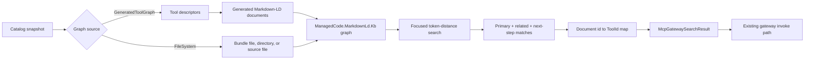

# ADR-0005: Markdown-LD Graph Search For Tool Retrieval

Status: Implemented  
Date: 2026-04-15  
Related Features: [`docs/Features/SearchQueryNormalizationAndRanking.md`](../Features/SearchQueryNormalizationAndRanking.md)  
Related ADRs: [`ADR-0002`](ADR-0002-search-ranking-and-query-normalization.md)

## Context

`ManagedCode.MCPGateway` must keep one searchable execution surface for local `AITool` instances and MCP tools while avoiding a mandatory paid embedding dependency. Vector ranking is still useful when a host opts into embeddings, but the default path needs to be deterministic, local, and strong enough for focused tool discovery.

The selected dependency is [`ManagedCode.MarkdownLd.Kb`](https://github.com/managedcode/markdown-ld-kb), a .NET library that turns Markdown knowledge documents into an in-memory RDF/JSON-LD graph and provides deterministic Tiktoken token-distance focused search. This lets the gateway model the tool catalog as a graph without introducing a hosted graph database or provider-specific AI service.

Constraints:

- keep one public gateway search/invoke surface
- keep local tools and MCP tools in one catalog
- keep embeddings optional and opt-in
- use the tokenizer behavior inside `ManagedCode.MarkdownLd.Kb` instead of carrying a separate local tokenizer strategy
- support graph creation during startup/index build and graph loading from a file-system path
- do not introduce Microsoft Agent Framework into the core package
- avoid a separate hosted graph service or durable graph store

## Decision

`ManagedCode.MCPGateway` will use `ManagedCode.MarkdownLd.Kb` internally as the default no-cost retrieval path.

Key points:

- `McpGatewaySearchStrategy.Graph` is the default search strategy.
- `McpGatewaySearchStrategy.MarkdownLd` is an alias for graph search.
- `McpGatewaySearchStrategy.Embeddings` opts into vector ranking and falls back to Markdown-LD graph ranking if vector search cannot complete.
- `McpGatewaySearchStrategy.Auto` remains a policy mode, but it is not the default and is not a third retrieval engine. It runs graph first and merges semantic vector results only when graph confidence is low or graph search is unavailable.
- The separate local `Tokenizer` strategy is removed. Token-based search now comes from `ManagedCode.MarkdownLd.Kb` inside the graph path.
- The graph index is built from the same immutable catalog snapshot as vector search.
- Every tool descriptor can become a Markdown-LD source document with title, description, tags, source identity, required arguments, input schema text, graph groups, related-tool hints, and next-step hints.
- File-system graph mode can load a gateway graph bundle JSON file, a directory of Markdown-LD source documents, or a single Markdown-LD source file.
- The gateway graph bundle is a portable set of Markdown-LD source documents, not a serialized RDF store. The runtime still builds the in-memory `ManagedCode.MarkdownLd.Kb` graph from those documents.
- Graph ranking maps focused primary, related, and next-step document hits back to normal `McpGatewaySearchMatch` results; invocation still uses the existing `ToolId` contract.
- `McpGatewayIndexBuildResult` exposes graph readiness through `IsGraphSearchEnabled`, `GraphNodeCount`, and `GraphEdgeCount`.

## Diagram

## Alternatives Considered

### Keep only vector retrieval

Pros:

- simpler ranking story
- no local graph indexing work

Cons:

- unusable in zero-embedding hosts
- makes a core package feature depend on an external model provider
- does not provide related/next-step graph expansion

Rejected because the default package experience must work without embeddings.

### Keep a separate local tokenizer fallback

Pros:

- lower indexing cost than graph construction
- familiar fallback from earlier package behavior

Cons:

- duplicates token-distance behavior already provided by `ManagedCode.MarkdownLd.Kb`
- creates three user-visible modes when the product requirement is embeddings versus Markdown-LD graph
- keeps legacy search code and tests alive after the graph path replaces it

Rejected because token-based retrieval should live inside the Markdown-LD graph strategy.

### Build a custom graph structure inside MCPGateway

Pros:

- full control over graph shape and ranking
- smaller transitive dependency set

Cons:

- duplicates graph parsing, RDF, token-distance, focused search, and export behavior already provided by `ManagedCode.MarkdownLd.Kb`
- risks growing a bespoke graph subsystem inside the gateway runtime
- harder to test against a reusable graph abstraction

Rejected because the dependency already owns the graph workflow and keeps the gateway focused on catalog/search/invoke orchestration.

### Make graph search a separate public execution surface

Pros:

- graph users could query lower-level graph details directly
- easier to expose SPARQL-first APIs later

Cons:

- splits the package's one search/invoke surface
- makes consumers choose between graph matches and gateway matches
- increases public API and compatibility burden before there is a concrete consumer contract

Rejected because graph search should enrich tool retrieval without changing invocation semantics.

## Consequences

Positive:

- hosts without embeddings get deterministic graph-backed retrieval by default
- local `AITool` and MCP descriptors share the same graph construction path
- file-backed mode lets hosts generate graph source documents separately and load them at runtime
- the graph index is available during lazy build or eager warmup
- public search results keep the existing match contract while adding graph ranking metadata and focused expansion results

Trade-offs:

- the package dependency surface grows through `ManagedCode.MarkdownLd.Kb` and its Markdown/RDF/tokenization dependencies
- default graph indexing does more work than the removed tokenizer-only path
- graph ranking is token-distance focused search over graph documents; it complements but does not replace true semantic embeddings
- file-backed graph mode must map loaded documents back to the current gateway catalog, so graph files and registered tools need stable source/tool identities

Mitigations:

- keep `McpGatewaySearchStrategy.Embeddings` available for hosts that want vector ranking
- keep `McpGatewaySearchStrategy.Auto` available as a graph-first hybrid policy mode for hosts that explicitly want semantic rescue
- keep graph implementation internal so future graph API changes do not leak into the public contract
- provide `McpGatewayMarkdownLdGraphFile` so tests and hosts can generate valid file-backed graph sources through the package flow

## Invariants

- `Graph` MUST remain the default search strategy.
- Forced `Graph` search MUST not require an embedding generator.
- Forced `Graph` search MUST build or load the Markdown-LD graph during explicit index build, lazy first use, or optional startup warmup.
- `Embeddings` search MUST fall back to Markdown-LD graph ranking when vector query generation fails or returns an unusable vector.
- `Auto` search MUST keep graph as the canonical first-pass ranking path and MUST only merge vector results when graph confidence is low or graph search is unavailable.
- `Auto` MUST NOT be documented as the default retrieval strategy.
- The package MUST NOT expose a separate local `Tokenizer` strategy.
- Graph search MUST return `McpGatewaySearchMatch` instances and MUST NOT add a separate invocation path.
- File-backed graph tests MUST generate their graph fixture through `McpGatewayMarkdownLdGraphFile` or generated Markdown-LD documents instead of relying on a hand-authored static artifact.
- Graph build failures MUST be diagnostic-only and MUST NOT make list/search/invoke unusable.

## Rollout And Rollback

Rollout:

1. Add `ManagedCode.MarkdownLd.Kb` to centralized package management.
2. Convert catalog tool descriptors into Markdown-LD source documents during index build.
3. Add file-system graph source options to `McpGatewayOptions`.
4. Add graph ranking as the default search path and vector ranking as an opt-in strategy.
5. Remove the old local tokenizer strategy and tests.
6. Add tests for generated graph mode, file-backed graph mode, local tool ranking, MCP tool ranking, focused related/next-step expansion, vector fallback to graph, and auto-discovery graph projection.
7. Update README, architecture overview, feature docs, and this ADR.

Rollback:

1. Remove `McpGatewaySearchStrategy.Graph` only if the graph-backed retrieval mode is intentionally withdrawn as a breaking API change.
2. Change the default search strategy only with an explicit compatibility decision.
3. Remove the `ManagedCode.MarkdownLd.Kb` dependency and graph build metadata from `McpGatewayIndexBuildResult`.

## Verification

Primary scenarios:

- local tool descriptors build a Markdown-LD graph index and rank through `graph`
- MCP tool descriptors build the same graph index and rank through `graph`
- generated graph mode builds during explicit index initialization
- file-backed graph mode uses a generated bundle file
- file-backed graph mode uses a generated directory of Markdown-LD documents
- vector query failure falls through to graph ranking
- `Auto` graph-first search can merge semantic vector rescue results when graph confidence is low
- default graph mode does not call the embedding generator
- chat-client and agent auto-discovery expose graph-ranked discovered tools when no embeddings are registered

Tests:

- `BuildIndexAsync_BuildsMarkdownLdGraphForToolDescriptors`
- `SearchAsync_GraphStrategyRanksMcpToolDescriptors`
- `SearchAsync_GraphStrategyReturnsFocusedMcpRelatedAndNextStepMatches`
- `SearchAsync_FileSystemMarkdownLdGraphModeUsesGeneratedBundleFile`
- `SearchAsync_FileSystemMarkdownLdGraphModeUsesGeneratedDirectory`
- `BuildIndexAsync_FileSystemMarkdownLdGraphModeReportsMissingPath`
- `McpGatewayMarkdownLdGraphFile_CreatesRoundTrippableGraphBundle`
- `BuildIndexAsync_DefaultGraphStrategyDoesNotCallEmbeddingGenerator`
- `SearchAsync_DefaultGraphStrategyUsesMarkdownLdTokenSearchAndTopFiveLimit`
- `SearchAsync_FallsBackWhenQueryEmbeddingFails`
- `SearchAsync_FallsBackWhenQueryVectorIsEmpty`
- `AutoDiscoveryChatClient_UsesFocusedGraphExpansionMatches`
- `ChatClientAgent_UsesAutoDiscoveryWithoutEmbeddings`

Commands:

- `dotnet tool restore`
- `dotnet restore ManagedCode.MCPGateway.slnx`
- `dotnet build ManagedCode.MCPGateway.slnx -c Release --no-restore`
- `dotnet build ManagedCode.MCPGateway.slnx -c Release --no-restore -p:RunAnalyzers=true`
- `dotnet test --solution ManagedCode.MCPGateway.slnx -c Release --no-build`
- `dotnet tool run roslynator analyze src/ManagedCode.MCPGateway/ManagedCode.MCPGateway.csproj tests/ManagedCode.MCPGateway.Tests/ManagedCode.MCPGateway.Tests.csproj`
- `cloc --include-lang=C# src tests`

## Stakeholder Notes

- Product: no-embedding hosts get the strongest local retrieval path by default while preserving the same invoke flow.
- Engineering: graph search stays inside runtime search and does not mutate catalog registration responsibilities.
- QA: graph behavior must be covered for generated, bundle-file, directory, local-tool, and MCP-tool scenarios.
- DevOps: no graph server or database is required; graph construction is in-memory during gateway index build or startup warmup.

## References

- [`ManagedCode.MarkdownLd.Kb`](https://github.com/managedcode/markdown-ld-kb)
- [`README.md`](../../README.md)
- [`docs/Architecture/Overview.md`](../Architecture/Overview.md)
- [`docs/Features/SearchQueryNormalizationAndRanking.md`](../Features/SearchQueryNormalizationAndRanking.md)
