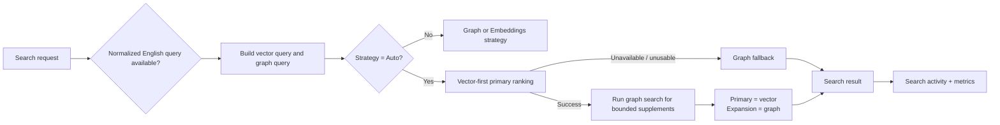

# ADR-0006: Vector-First Auto Search And Runtime Telemetry

Status: Implemented  
Date: 2026-04-18  
Related Features: [`docs/Features/AutoVectorFirstSearchAndPerformance.md`](../Features/AutoVectorFirstSearchAndPerformance.md)  
Related ADRs: [`ADR-0002`](ADR-0002-search-ranking-and-query-normalization.md), [`ADR-0005`](ADR-0005-markdown-ld-graph-search-for-tool-retrieval.md)

## Context

`ManagedCode.MCPGateway` currently keeps `Graph` as the default retrieval mode and exposes `Auto` as an explicit hybrid policy for hosts that configure embeddings. The shipped `Auto` behavior runs Markdown-LD graph search first, then uses vector ranking only as a low-confidence rescue path.

That policy is weak for multilingual or noisy inputs:

- token-distance graph retrieval sees the noisiest query representation first
- graph confidence can become misleadingly strong before semantic ranking gets a chance
- auto-discovery can then expose graph-selected tools before semantic retrieval has anchored the result set

Recent reference analysis from Strata/Klavis, MCPProxy, hyper-mcp, and agentgateway also reinforced two adjacent gaps:

- progressive discovery benefits from a semantically anchored primary result set with smaller contextual expansion
- production gateways need built-in observability for search and index behavior, not only ad-hoc diagnostics

Constraints:

- keep `Graph` as the default strategy
- keep the gateway library-first and MCP-tool-first
- do not introduce Microsoft Agentic Framework
- do not expose a separate public BM25 strategy in this task; BM25/fuzzy support remains inside the Markdown-LD graph path
- keep vector search optional and host-provided

## Decision

`McpGatewaySearchStrategy.Auto` will change from graph-first rescue mode to vector-first hybrid mode.

Key points:

- When vectors are available, `Auto` performs vector ranking first and treats that semantic ordering as the primary result set.
- Markdown-LD graph search still runs in `Auto`, but only after vector ranking, to supplement confidence and to supply related or next-step matches.
- Graph supplementation is semantically bounded by the vector candidate window so irrelevant graph-only hits do not flood multilingual or noisy searches.
- For larger catalogs, `Auto` skips unbounded graph supplementation after a usable vector primary result until graph retrieval can be candidate-bounded cheaply; vector-unusable fallback still uses the graph path.
- When normalization changes the query, vector search preserves both the original query and the English-normalized query, while graph search prefers the English-normalized query.
- When query embeddings are unavailable, fail, or return an unusable vector, `Auto` falls back to Markdown-LD graph ranking.
- The package will emit built-in .NET runtime telemetry for index builds and search execution through `ActivitySource` and `Meter`, including vector token usage for query embeddings and index embedding batches.

## Diagram

## Alternatives Considered

### Keep graph-first `Auto`

Pros:

- reuses the existing deterministic graph-first policy
- avoids a semantic-first merge redesign

Cons:

- multilingual/noisy queries pay the highest quality penalty
- graph can lock the primary ordering before embeddings run
- auto-discovery surfaces the wrong tools first when graph ranking is noisy

Rejected because it does not solve the concrete retrieval defect.

### Make `Auto` pure vector with no graph pass

Pros:

- simplest runtime path
- fully semantic primary ranking

Cons:

- loses graph-related and next-step expansion
- weakens deterministic supplement behavior when embeddings are present
- throws away the graph investment instead of using it where it is strongest

Rejected because graph structure still adds value after semantic primary selection.

### Add a public BM25 strategy in the same change

Pros:

- gives a classic lexical fallback
- aligns with some external proxy implementations

Cons:

- expands public strategy surface beyond the user’s requested fix
- adds another retrieval mode to document and maintain
- risks diluting the graph-vs-vector product story

Rejected for this task. It remains a possible future decision if a concrete requirement appears.

## Consequences

Positive:

- `Auto` becomes robust for multilingual and noisy tool search when embeddings are available
- semantic primary results drive auto-discovery before graph expansion
- graph still contributes structured related and next-step context
- hosts gain built-in telemetry for search and indexing without third-party dependencies

Trade-offs:

- `Auto` always spends a query embedding call when vectors are available
- graph supplementation adds a second retrieval stage to successful auto searches
- telemetry adds more runtime signals that must be documented clearly

Mitigations:

- keep `Graph` as the default zero-embedding path
- keep graph supplementation bounded by the vector candidate set
- keep telemetry built on first-party .NET diagnostics only
- add deterministic performance regression tests and full BenchmarkDotNet benchmark coverage

## Invariants

- `Graph` remains the default search strategy.
- `Auto` is not the default search strategy.
- `Auto` must run vector ranking first when vectors are available.
- `Auto` must fall back to graph ranking when query embeddings are unavailable or unusable.
- `Auto` must not let graph-only noise override vector-selected primary matches.
- Graph supplements in `Auto` must stay bounded by semantic candidates instead of returning arbitrary graph-only hits.
- Query normalization remains optional and keyed.
- Built-in telemetry must not require additional external packages beyond the .NET diagnostics stack.

## Rollout And Rollback

Rollout:

1. Refactor query shaping for separate vector and graph query text.
2. Replace graph-first `Auto` with vector-first hybrid merge behavior.
3. Emit built-in search and build telemetry.
4. Update tests, README, architecture overview, and search ADR references.

Rollback:

1. Revert `Auto` to graph-first only if a concrete compatibility decision explicitly prefers deterministic graph primacy over multilingual semantic quality.
2. Remove runtime telemetry only if the package intentionally decides to avoid .NET diagnostics instrumentation.

## Verification

- `dotnet tool restore`
- `dotnet restore ManagedCode.MCPGateway.slnx`
- `dotnet build ManagedCode.MCPGateway.slnx -c Release --no-restore`
- `dotnet build ManagedCode.MCPGateway.slnx -c Release --no-restore -p:RunAnalyzers=true`
- `dotnet test --solution ManagedCode.MCPGateway.slnx -c Release --no-build`
- `dotnet tool run roslynator analyze src/ManagedCode.MCPGateway/ManagedCode.MCPGateway.csproj tests/ManagedCode.MCPGateway.Tests/ManagedCode.MCPGateway.Tests.csproj`
- `cloc --include-lang=C# src tests`

## References

- [`docs/Features/AutoVectorFirstSearchAndPerformance.md`](../Features/AutoVectorFirstSearchAndPerformance.md)
- [`README.md`](../../README.md)
- [Klavis Strata](https://github.com/Klavis-AI/klavis)
- [MCPProxy](https://github.com/smart-mcp-proxy/mcpproxy-go)
- [hyper-mcp](https://github.com/hyper-mcp-rs/hyper-mcp)
- [agentgateway](https://github.com/agentgateway/agentgateway)
