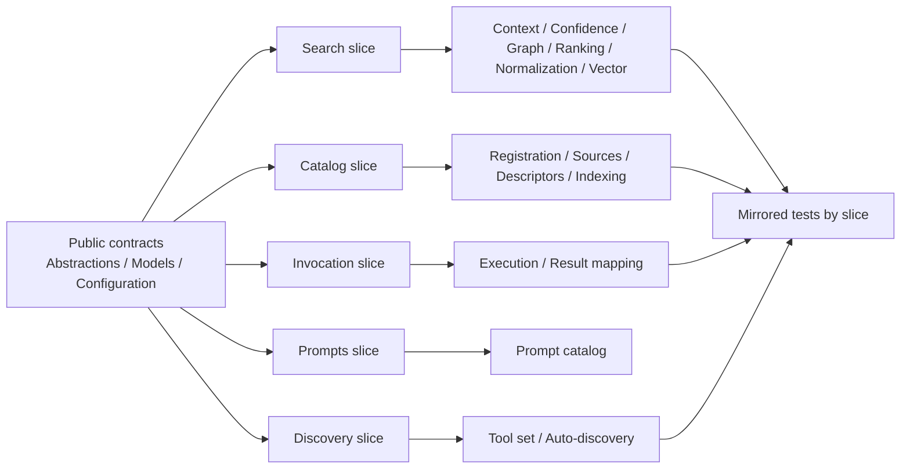

# ADR-0007: Vertical-Slice Package Organization

Status: Accepted  
Date: 2026-04-21  
Related ADRs: [`ADR-0001`](ADR-0001-runtime-boundaries-and-index-lifecycle.md), [`ADR-0003`](ADR-0003-reusable-chat-client-and-agent-tool-modules.md), [`ADR-0005`](ADR-0005-markdown-ld-graph-search-for-tool-retrieval.md), [`ADR-0006`](ADR-0006-vector-first-auto-search-and-runtime-telemetry.md)  

## Context

Before this decision, `ManagedCode.MCPGateway` already had strong package boundaries at the public API level:

- `Abstractions/`
- `Models/`
- `Configuration/`
- `Registration/`
- `Internal/`

The problem is inside the implementation and test trees. The current organization is still dominated by technical buckets and one large partial runtime:

- `Internal/Runtime/Core`
- `Internal/Runtime/Catalog`
- `Internal/Runtime/Search`
- `Internal/Runtime/Graph`
- `Internal/Runtime/Invocation`
- `Internal/Runtime/Embeddings`
- `tests/.../Search`
- `tests/.../TestSupport`

That keeps feature ownership diffuse:

- one end-to-end feature is often split across `Models`, `Registration`, `Internal/Catalog`, and `Internal/Runtime/*`
- `McpGatewayRuntime` remains the central gravity well
- search is spread across graph, vector, normalization, caching, telemetry, and test folders that do not read as one slice

Measured signals from the audit:

- `Internal/Runtime/Search`: `1112` LOC
- `Internal/Runtime/Graph`: `997` LOC
- `Internal/Runtime/Catalog`: `934` LOC
- package root public files: `819` LOC
- `tests/.../Search`: `3546` LOC
- `tests/.../TestSupport`: `1496` LOC

Migration constraints:

- keep the package library-first and reusable
- keep public contracts separate from `Internal/` implementation
- prefer moving by feature ownership first; namespace and API cleanup may follow when it improves clarity and the package remains coherent
- reduce large-file and high-CRAP hotspots incrementally, not through one unsafe rewrite

## Decision

The repository will adopt feature-first vertical-slice organization for non-trivial package areas while preserving the public/internal split.

Key points:

- Public contracts may stay distinct, but their owning feature must be explicit.
- Internal implementation must be grouped by feature and subfeature instead of by one shared `Runtime/*` bucket.
- New functionality should land in the target slice first; do not grow the old flat buckets when a feature-specific home exists.
- Existing large technical buckets must be retired incrementally through safe move batches.
- Tests must mirror the same slice ownership and stop accumulating in generic folders such as `Search/` and `TestSupport/`.

The target package slices are now:

- `Gateway/`
- `Discovery/`
- `Catalog/`
- `Search/`
- `Invocation/`
- `Prompts/`
- `Hosting/`

## Diagram

## Alternatives Considered

### Keep the current technical-bucket layout

Pros:

- no file moves
- current docs already reference the existing folder names

Cons:

- keeps `McpGatewayRuntime` as the implementation center of gravity
- search, catalog, and discovery keep leaking across unrelated folders
- reviewers must understand multiple technical trees to change one feature

Rejected because it preserves the problem the user explicitly asked to remove.

### Collapse public and internal files into one mixed feature tree

Pros:

- strongest feature locality
- simplest read path for a single slice

Cons:

- conflicts with the repository rule that public API folders stay clearly separated from internal implementation
- makes public contract review noisier in a NuGet package

Rejected because the package still needs a clean public surface map.

### Keep one large partial runtime but split it into more technical folders

Pros:

- minimal class churn
- low namespace impact

Cons:

- folders improve, but responsibilities still stay trapped in one type
- large-file and CRAP hotspots remain
- slice ownership is still implicit instead of explicit

Rejected because it is a cosmetic directory change, not a real architecture move.

## Consequences

Positive:

- feature ownership becomes reviewable and auditable
- new contributors can change one slice without reading the whole runtime
- tests can mirror the production feature boundaries directly
- high-risk methods gain natural extraction targets

Trade-offs:

- more folders and more collaborators
- incremental refactors require temporary compatibility seams
- docs and architecture maps must be kept current during the migration

Mitigations:

- keep namespaces stable while moving files first
- move tests before or alongside production moves
- prioritize the largest and riskiest buckets first

## Temporary Exception

One maintainability exception remains after the slice move and the MCP metadata/routing expansion:

- `src/ManagedCode.MCPGateway/Search/Internal/Graph/McpGatewayRuntime.GraphIndexing.cs` is currently `720` code LOC, which is `70` lines above the repository `file_max_loc` limit of `650`.

Justification:

- the file is now isolated inside the correct `Search/Graph` slice instead of being hidden in a flat runtime bucket
- the latest MCP improvements added category, tag, data-source, and execution-contract graph enrichment in one place, and splitting that logic safely needs a dedicated follow-up instead of a rushed late-turn cut

Required follow-up:

- extract graph markdown rendering and metadata/tag projection into dedicated collaborators inside `Search/Internal/Graph/`
- keep the follow-up local to the graph slice instead of re-expanding a shared runtime bucket

## Invariants

- Public package identity remains `ManagedCode.MCPGateway`.
- Public API naming stays concise and `McpGateway`-aligned.
- Public contracts remain visibly separate from `Internal/` implementation.
- New non-trivial code must prefer a feature slice over a generic shared folder.
- Search, catalog, discovery, invocation, prompts, and hosting must each have an explicit owning slice.
- Tests must mirror feature ownership instead of growing a generic `TestSupport` dump.

## Rollout

1. Move package-root public files into `Gateway/` and `Discovery/`.
2. Split `tests/.../Search` and `tests/.../TestSupport` into mirrored sub-slices.
3. Merge `Internal/Catalog/*` and `Internal/Runtime/Catalog/*` into one catalog slice.
4. Break large runtime search and graph files into feature collaborators.
5. Finish by isolating hosting-only concerns such as server export, warmup, and telemetry.

## Verification

- `dotnet tool restore`
- `dotnet restore ManagedCode.MCPGateway.slnx`
- `dotnet build ManagedCode.MCPGateway.slnx -c Release --no-restore`
- `dotnet test --solution ManagedCode.MCPGateway.slnx -c Release --no-build`
- `dotnet tool run coverlet tests/ManagedCode.MCPGateway.Tests/bin/Release/net10.0/ManagedCode.MCPGateway.Tests.dll --target "./tests/ManagedCode.MCPGateway.Tests/bin/Release/net10.0/ManagedCode.MCPGateway.Tests" --targetargs "" --format cobertura --output artifacts/coverage/coverage.cobertura.xml`
- `dotnet tool run roslynator analyze src/ManagedCode.MCPGateway/ManagedCode.MCPGateway.csproj tests/ManagedCode.MCPGateway.Tests/ManagedCode.MCPGateway.Tests.csproj`
- `cloc src/ManagedCode.MCPGateway tests/ManagedCode.MCPGateway.Tests --exclude-dir=bin,obj --include-lang="C#" --by-file --csv`

## References

- [`docs/Architecture/Overview.md`](../Architecture/Overview.md)
- [`AGENTS.md`](../../AGENTS.md)
