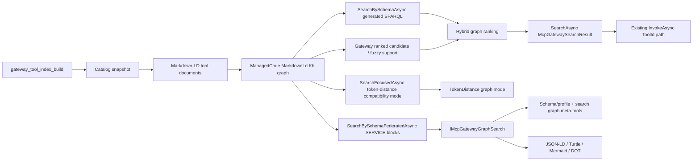

# ADR-0012: Schema-Aware SPARQL Graph Search

Status: Implemented
Date: 2026-05-03
Related ADRs: [`ADR-0005`](ADR-0005-markdown-ld-graph-search-for-tool-retrieval.md), [`ADR-0006`](ADR-0006-vector-first-auto-search-and-runtime-telemetry.md)
Related Features: [`docs/Features/SearchQueryNormalizationAndRanking.md`](../Features/SearchQueryNormalizationAndRanking.md)

## Implementation Plan

- [x] Upgrade `ManagedCode.MarkdownLd.Kb` to the version that exposes schema-aware and federated SPARQL graph search.
- [x] Add schema-aware SPARQL graph retrieval as the primary Markdown-LD graph path.
- [x] Use ranked graph candidate search as a hybrid support signal and fuzzy fallback, while keeping token-distance as an explicit compatibility mode.
- [x] Expose graph-specific schema/profile inspection, search, federation, evidence, generated SPARQL, and export through `IMcpGatewayGraphSearch`.
- [x] Add built-in graph meta-tools for schema/profile inspection, tool index rebuilds, schema search, federated search, and graph export.
- [x] Add automated coverage for schema profile inspection, index rebuild tools, schema SPARQL search, federated local graph search, graph tools, and graph export.
- [x] Route non-federated direct graph tool search through the same large-catalog candidate-backed schema path as `SearchAsync`.
- [x] Update README and architecture overview.
- [x] Run final repository verification and record commands in the task closeout.

## Context

`ManagedCode.MCPGateway` already uses `ManagedCode.MarkdownLd.Kb` as the default no-embedding retrieval path. Earlier graph search relied on focused token-distance graph search. That was useful, but it did not expose the stronger upstream 0.2.x capabilities: schema-aware SPARQL generation, schema-profile validation, schema/profile inspection, federated SPARQL `SERVICE` execution, graph export formats, ranked BM25 graph search, and fuzzy token matching for noisy queries.

The package needs a better graph search story without turning `IMcpGateway` into a grab bag of graph/index methods. `IMcpGateway` remains the MCP-facing list/search/route/invoke facade. Schema/profile inspection, graph evidence, generated SPARQL, federation, explicit index-build tooling, and graph export are search/index concerns, so they need their own public boundary.

Constraints:

- keep `IMcpGateway` stable for normal MCP gateway operations
- preserve the existing `SearchAsync(...)` and `InvokeAsync(...)` flow
- keep default search usable without embeddings or a graph server
- keep federation powerful but explicit through configured endpoint allowlists
- do not introduce hidden remote SPARQL calls from normal search
- use the shipped NuGet package for `ManagedCode.MarkdownLd.Kb`

## Decision

Markdown-LD graph search in `ManagedCode.MCPGateway` will be schema-aware SPARQL-first when graph mode is hybrid or schema-aware.

Key points:

- `ManagedCode.MarkdownLd.Kb` `SearchBySchemaAsync(...)` is the primary graph retrieval call for `McpGatewaySearchStrategy.Graph`.
- `McpGatewayMarkdownLdGraphSearchMode.Hybrid` is the default graph search mode.
- Large catalogs first use a gateway-built ranked candidate index over searchable tool node IDs to choose a bounded candidate window, then run schema-aware SPARQL over that focused graph instead of executing full-graph SPARQL for every query.
- Non-federated `IMcpGatewayGraphSearch.SearchGraphAsync(...)` and the built-in `gateway_graph_schema_search` tool use the same candidate-backed schema path as normal `SearchAsync(...)`.
- Hybrid mode executes schema-aware SPARQL first and merges ranked graph candidate results as support.
- If schema-aware search finds no mapped gateway tools, hybrid mode enables fuzzy token matching in the ranked candidate fallback.
- `McpGatewayMarkdownLdGraphSearchMode.SchemaAware` forces schema-aware SPARQL only.
- `McpGatewayMarkdownLdGraphSearchMode.TokenDistance` remains available for hosts that explicitly want the older lower-level graph ranking.
- `IMcpGatewayGraphSearch` owns graph-specific schema/profile, query, and export operations.
- `McpGatewayToolSet.CreateGraphTools(...)` exposes:
  - `gateway_graph_schema_describe`
  - `gateway_tool_index_build`
  - `gateway_graph_schema_search`
  - `gateway_graph_federated_search`
  - `gateway_graph_export`
- Federated graph search requires explicit configured endpoints through `AddMarkdownLdFederatedServiceEndpoint(...)`.
- The local gateway graph can be bound as a federated service for tests and controlled local federation.
- Runtime graph export returns JSON-LD, Turtle, Mermaid flowchart, and DOT graph artifacts.

## Diagram

## Alternatives Considered

### Keep token-distance as the primary graph path

Pros:

- smaller runtime change
- preserves earlier behavior exactly

Cons:

- leaves the upstream schema-aware SPARQL capability unused
- does not expose generated SPARQL or graph evidence to callers
- weakens graph retrieval when predicate/type structure can narrow the search

Rejected because the package should capture the upstream graph-search value end-to-end.

### Put graph search and export methods directly on `IMcpGateway`

Pros:

- one interface for every caller operation
- easy service lookup

Cons:

- expands the MCP-facing facade with search/index-specific concepts
- makes future graph API evolution harder
- violates the boundary that `IMcpGateway` is the normal list/search/route/invoke gateway

Rejected because graph search and graph export belong to a narrower `IMcpGatewayGraphSearch` surface.

### Disable federation because remote SPARQL can be risky

Pros:

- fewer configuration and network concerns

Cons:

- removes a useful upstream capability
- prevents hosts from querying curated graph services
- forces consumers to build their own federation wrapper

Rejected because federation is valuable when it is explicit, allowlisted, and observable.

## Consequences

Positive:

- default graph search now benefits from schema-aware SPARQL over the generated Markdown-LD graph
- hybrid fallback now benefits from ranked candidate and fuzzy token matching for typo-heavy queries without requiring embeddings
- callers can inspect schema/profile state, generated SPARQL, graph evidence, service endpoints, and mapped gateway tools
- hosts can expose graph search and federated graph search as built-in `AITool` functions
- direct graph search tools no longer bypass the large-catalog schema-search optimization
- hosts can expose schema/profile and index-build tools so agents can validate the tool graph before relying on graph retrieval
- federation is powerful without hidden network discovery
- graph export is available both from generated documents and from the runtime graph index

Negative / risks:

- graph search now depends on more upstream `ManagedCode.MarkdownLd.Kb` behavior
- schema-profile drift can reduce result quality if generated graph predicates change
- large-catalog schema search still materializes a per-query candidate graph until upstream schema search exposes a candidate filter such as `CandidateNodeIds`
- federated queries add endpoint and configurable timeout policy that operators must understand

Mitigations:

- validate schema search profiles and return diagnostics
- expose schema/profile and graph index state through `DescribeGraphSchemaAsync(...)` and `gateway_graph_schema_describe`
- keep token-distance mode as an explicit compatibility option
- keep ranked candidate/fuzzy matching inside the Markdown-LD graph path rather than exposing a separate public token strategy
- keep ranked candidate/fuzzy use bounded by the gateway index instead of recreating upstream ranked-search artifacts per query
- replace per-query candidate graph materialization with an upstream schema-search candidate filter when `ManagedCode.MarkdownLd.Kb` exposes one, ideally emitted as SPARQL `VALUES`
- keep federation endpoints allowlisted and diagnostic-driven
- cover local schema search, schema/profile inspection, index-build tooling, federated local graph search, graph tools, and export with tests

## Impact

### Code

- `Search/Abstractions/IMcpGatewayGraphSearch.cs` adds the graph search/export boundary.
- `McpGateway` and `McpGatewayRuntime` implement `IMcpGatewayGraphSearch`.
- `McpGatewayOptions` adds graph search mode, federated endpoint configuration, and a configurable federated SPARQL query timeout.
- `Search/Internal/Graph/*` owns schema profile creation, schema/profile description, schema/federated operations, graph export, and hybrid graph ranking.
- `McpGatewayToolSet` adds graph schema/profile, index-build, search, federation, and export meta-tools while keeping basic meta-tools usable with a plain `IMcpGateway`.

### Data / Configuration

- `ManagedCode.MarkdownLd.Kb` is upgraded to `0.2.5`.
- `MarkdownLdGraphSearchMode` defaults to `Hybrid`.
- Federated endpoints are configured through `AddMarkdownLdFederatedServiceEndpoint(...)`; federated query timeout defaults to `McpGatewayOptions.DefaultMarkdownLdFederatedSparqlQueryTimeout` and can be overridden or disabled through `MarkdownLdFederatedSparqlQueryTimeout`.

### Documentation

- `README.md` documents schema/profile inspection, schema-aware SPARQL graph search, federation, graph export, and graph tools.
- `docs/Architecture/Overview.md` documents the `IMcpGatewayGraphSearch` boundary, index-build tooling, and SPARQL graph retrieval.
- `ADR-0005` remains the original graph-search decision; this ADR records the 0.2.x schema/SPARQL, ranked candidate/fuzzy, and federation evolution.

## Verification

Objectives:

- Prove default graph search uses schema-aware graph search and still maps results to gateway tool matches.
- Prove schema/profile inspection returns graph state, predicates, prefixes, and validation diagnostics.
- Prove direct graph search returns generated SPARQL and graph evidence.
- Prove federated graph search executes through an explicit local graph service binding.
- Prove graph index-build tooling rebuilds the current catalog graph and returns node/edge state.
- Prove graph meta-tools expose schema SPARQL results to `AITool` callers.
- Prove direct graph tool search over a large catalog uses the same optimized search path as normal graph search.
- Prove graph export returns portable RDF/visualization artifacts.
- Prove basic meta-tools do not require graph search when a caller constructs `McpGatewayToolSet` around a plain `IMcpGateway`.

Tests:

| ID | Scenario | Level | Expected result |
| --- | --- | --- | --- |
| TST-001 | `SearchAsync_GraphStrategyReturnsFocusedMcpRelatedAndNextStepMatches` | Integration | Graph search reports schema search and preserves focused related/next-step matches |
| TST-001B | `SearchAsync_HybridGraphUsesRankedFuzzyFallbackForTypoHeavyQueryWithoutEmbeddings` | Integration | Hybrid graph search uses schema fallback plus ranked fuzzy candidate search to recover a typo-heavy shipment query |
| TST-002 | `SearchGraphAsync_ReturnsSchemaSparqlAndMappedGatewayTools` | Integration | Direct graph search returns generated SPARQL, evidence, and mapped `ToolMatch` |
| TST-003 | `SearchGraphAsync_FederatesThroughExplicitLocalGraphService` | Integration | Federated graph search emits `SERVICE` SPARQL and maps the local graph match |
| TST-004 | `SearchGraphAsync_BlocksUnconfiguredFederatedEndpoint` | Integration | Federated graph search reports blocked endpoints instead of using unconfigured services |
| TST-005 | `DescribeGraphSchemaAsync_ReturnsValidatedSchemaProfileAndIndexState` | Integration | Direct schema/profile inspection returns predicates, prefixes, exact graph node/edge counts, and diagnostics |
| TST-006 | `CreateGraphTools_SchemaToolReturnsSchemaProfileAndGraphState` | Integration | Built-in schema/profile tool returns graph profile and graph state |
| TST-007 | `CreateGraphTools_IndexBuildToolBuildsToolGraphIndex` | Integration | Built-in index-build tool rebuilds the tool graph and returns node/edge state |
| TST-008 | `CreateGraphTools_SearchToolReturnsGeneratedSparqlAndMappedTool` | Integration | Built-in graph search tool returns generated SPARQL and mapped gateway tool |
| TST-009 | `McpGatewayMarkdownLdGraphFile_ExportsPortableGraphArtifacts` | Integration | Graph export includes JSON-LD, Turtle, Mermaid, and DOT |
| TST-010 | `ChatOptions_AddMcpGatewayGraphTools_ResolvesToolSetAndAvoidsDuplicates` | Integration | Graph tools can be added to chat options without duplicates |
| TST-011 | `ToolSet_CreateTools_DoesNotRequireGraphSearchSurface` | Integration | Basic meta-tools still work with a plain `IMcpGateway` |
| TST-012 | `SchemaGraphSearchAsync_LargeCatalogUsesDirectOptimizedGraphToolPath` | Integration | Built-in graph search tool maps the large-catalog weather query through generated SPARQL without bypassing the optimized path |

Commands:

- `dotnet tool restore`
- `dotnet restore ManagedCode.MCPGateway.slnx`
- `dotnet build ManagedCode.MCPGateway.slnx -c Release --no-restore`
- `dotnet build ManagedCode.MCPGateway.slnx -c Release --no-restore -p:RunAnalyzers=true`
- `dotnet test --solution ManagedCode.MCPGateway.slnx -c Release --no-build`
- `dotnet format ManagedCode.MCPGateway.slnx --verify-no-changes`
- `dotnet tool run roslynator analyze src/ManagedCode.MCPGateway/ManagedCode.MCPGateway.csproj tests/ManagedCode.MCPGateway.Tests/ManagedCode.MCPGateway.Tests.csproj`
- `cloc --include-lang=C# src tests`

## Rollout And Rollback

Rollout:

1. Ship the dependency and runtime changes together.
2. Keep `Graph` as the default search strategy and `Hybrid` as the default graph mode.
3. Document federation as explicit allowlist configuration.
4. Watch search diagnostics and graph search telemetry after adoption.

Rollback:

1. Set `UseTokenDistanceMarkdownLdGraphSearch()` to force the previous token-distance graph behavior.
2. Remove configured federated endpoints to disable remote federation.
3. Revert to the previous `ManagedCode.MarkdownLd.Kb` version only if the schema/SPARQL package surface is intentionally withdrawn.

## References

- [`ManagedCode.MarkdownLd.Kb`](https://github.com/managedcode/markdown-ld-kb)
- [`README.md`](../../README.md)
- [`docs/Architecture/Overview.md`](../Architecture/Overview.md)
- [`docs/Features/SearchQueryNormalizationAndRanking.md`](../Features/SearchQueryNormalizationAndRanking.md)
