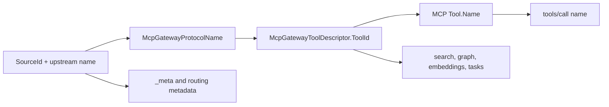

# ADR-0013: MCP-Safe Canonical Protocol Names

## Status

Accepted

## Context

`ManagedCode.MCPGateway` previously built gateway tool ids as `SourceId:ToolName` and reused that value as the downstream MCP `Tool.Name`. Downstream MCP hosts can reject those names because MCP tool names used by hosts such as ChatGPT must fit the safe identifier shape of letters, digits, `_`, and `-` with a bounded length.

The gateway cannot fix this by renaming only the exported MCP surface. That would create two names for the same tool: one internal `ToolId` and another public `Tool.Name`. Tool search, graph export, embedding lookup, task execution, and `tools/call` would then disagree about identity.

## Decision

Gateway-owned protocol names use one canonical lowercase MCP-safe identity.

- `McpGatewayToolDescriptor.ToolId`, downstream MCP `Tool.Name`, and downstream `tools/call` names are the same value.
- Unique tools use the normalized upstream tool name, for example `notion-fetch`.
- Colliding normalized tool names receive deterministic source-qualified safe ids, for example `docs_search_repository`.
- Exact duplicate source/tool pairs receive a deterministic suffix instead of being skipped.
- Hash suffixes are added only when length or collision handling requires them; normal short names such as `notion-fetch` remain unchanged.
- Names that exceed the bounded host limit keep a readable normalized prefix and receive a deterministic hash suffix within 64 characters instead of being blindly truncated.
- Prompt ids and exported resource names are lowercase MCP-safe source-qualified names.
- Gateway-owned name resolution is case-insensitive for tools, prompts, task support maps, and embedding-store lookups.
- Raw upstream `SourceId`, tool name, prompt name, resource name, and URI remain separate routing metadata and `_meta` values.

## Consequences

- Downstream MCP hosts receive tool, prompt, and exported resource names that fit MCP-safe host constraints.
- The gateway keeps one identity for each tool across catalog, search, embedding, hosting, task, and invocation paths.
- Consumers invoking old `source:tool` ids must use the canonical id returned by `ListToolsAsync` or `tools/list`.
- Duplicate normalized names no longer silently remove tools from the catalog; they are retained with deterministic collision-safe ids.
- Case variations such as `ToolID`, `toolid`, or mixed-case tool names do not create separate gateway-owned identities.

## Verification

- Catalog tests assert duplicate ids are resolved and retained.
- Hosting integration tests assert exported `tools/list`, `tools/call`, prompts, and task paths use the canonical ids.
- Resolver tests assert case-insensitive tool and prompt resolution.
- Embedding-store tests assert case-insensitive tool id lookup.
- Full verification command: `dotnet test --solution ManagedCode.MCPGateway.slnx -c Release --no-build`.
