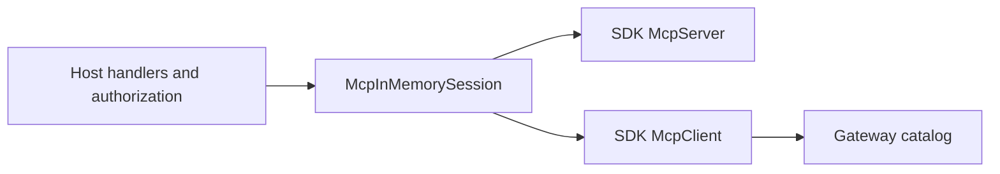

# ADR-0015: Own the in-process SDK MCP session in Hosting

Status: Accepted
Date: 2026-09-23

## Context

Consumers that expose an already configured MCP server through a gateway need an SDK client in the same process. A consumer previously assembled two pipes, two SDK transports, server lifetime, initialization, cancellation, and teardown itself. That transport lifecycle is independent of its tool catalog, authorization, and JSON-LD vocabulary.

## Decision

`ManagedCode.MCPGateway` exposes `McpInMemorySession` in the Hosting slice. The caller supplies `McpServerOptions`, scoped services, a logger factory, and a cancellation token. The session owns only the paired SDK transports, client, server run task, and disposal. The caller owns the configured handlers and retains authorization and graph policy.

## Consequences

Consumers remove their copied pipe and lifetime code. Separate sessions remain isolated, and cancelling one session cancels its server handlers without stopping another. No application vocabulary or business policy is added to the package.
