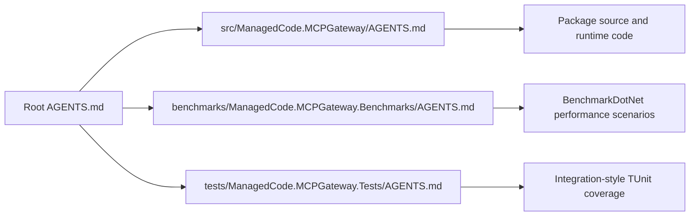
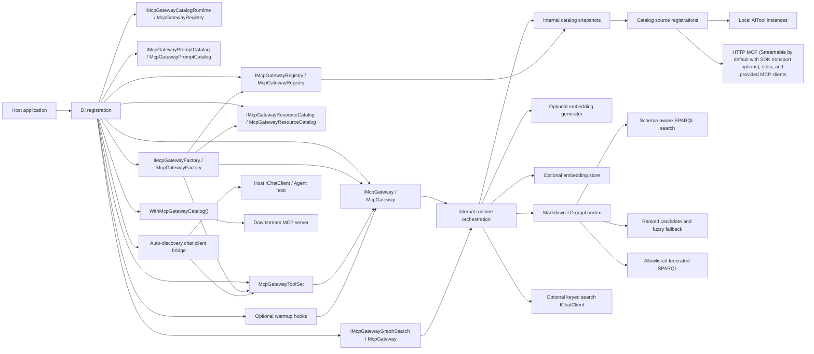
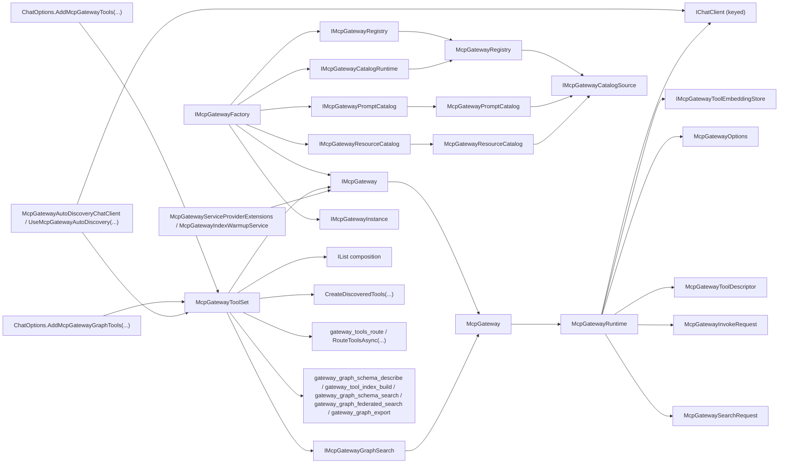
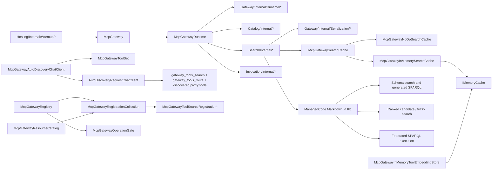

# Architecture Overview

## Scoping (read first)

This document is the module map for `ManagedCode.MCPGateway`.

In scope:

- package boundaries
- runtime collaboration between the public facade, registry, meta-tools, warmup hooks, and internal runtime
- dependency direction between public APIs, internal modules, and optional AI services
- benchmark project boundaries for repeatable performance and allocation measurements

Out of scope:

- feature-level ranking metrics
- test corpus details
- CI or release process

## Summary

`ManagedCode.MCPGateway` exposes seven public DI surfaces and one reusable tool-set surface:

- `IMcpGateway` for list/search/invoke
- `IMcpGatewayRegistry` for additive catalog registration
- `IMcpGatewayCatalogRuntime` for full in-memory catalog reset and reconfiguration
- `IMcpGatewayGraphSearch` for schema/profile inspection, schema-aware SPARQL graph search, explicit graph federation, graph evidence, and graph export
- `IMcpGatewayPromptCatalog` for aggregated MCP prompt listing, retrieval, and gateway-owned prompt composition
- `IMcpGatewayResourceCatalog` for aggregated MCP resource listing, template listing, and source-aware reads
- `IMcpGatewayFactory` for isolated custom gateway instances created from host DI
- `McpGatewayToolSet` for reusable search, route, and invoke meta-tools

`McpGateway` stays a thin facade over `McpGatewayRuntime`, which reads immutable catalog snapshots, coordinates default schema-aware Markdown-LD SPARQL graph search with gateway-built ranked candidate selection for large catalogs and ranked candidate/fuzzy graph fallback for focused noisy queries, vector-first `Auto` search with bounded Markdown-LD supplementation, or explicit embedding-first search, optionally rewrites queries through a keyed `IChatClient`, emits built-in .NET telemetry for build/search operations including vector token usage, calibrates user-facing search confidence before returning matches, and invokes local or MCP tools. Optional startup warmup is available through a service-provider extension or hosted background service without changing the lazy default.

Graph-specific search and indexing operations deliberately sit on `IMcpGatewayGraphSearch` and built-in graph tools instead of expanding the MCP-facing `IMcpGateway` contract. That surface exposes schema/profile inspection, generated SPARQL, graph evidence, explicit allowlisted federated SPARQL, mapped gateway tool matches, and runtime graph export while normal gateway search still returns the stable `McpGatewaySearchResult` and invocation still uses the same `ToolId` path. Non-federated direct graph tool search reuses the same candidate-backed schema path as normal graph search so agents cannot bypass the large-catalog optimization by calling `gateway_graph_schema_search`.

The package also keeps chat-client and agent integration generic: `McpGatewayToolSet` is the source of reusable `AITool` search, route, invoke, graph schema-describe, tool index-build, graph schema-search, graph federated-search, and graph export meta-tools plus discovered proxy tools, `ChatOptions.AddMcpGatewayTools(...)` and `ChatOptions.AddMcpGatewayGraphTools(...)` remain the low-level bridges, and `McpGatewayAutoDiscoveryChatClient` plus `UseMcpGatewayAutoDiscovery(...)` provide the recommended staged host wrapper that starts with the gateway search/route/invoke tools and replaces the discovered proxy set on each new search result without introducing a hard Agent Framework dependency into the core package.

For MCP interoperability in the other direction, the package also exposes `WithMcpGatewayCatalog()` as a server-builder extension. Hosts can take one aggregated gateway catalog and re-export it as a downstream MCP server that exposes the combined tools, prompts, and resources from multiple upstream MCP sources plus gateway-owned prompts. That export also proxies MCP completions, forwarded prompt list-change notifications, resource subscriptions, forwarded resource-updated notifications, logging level changes, and task-backed tool execution through the MCP tasks surface. Resource URIs are rewritten into gateway-owned source-qualified URIs during export so downstream reads, completions, and forwarded update notifications stay unambiguous even when upstream servers reuse the same URI spaces. By default the export binds to the singleton gateway services in DI, but hosts can override that binding per request or per downstream MCP session through `IMcpGatewayServerBindingResolver`, which allows route-specific or tenant-specific gateway instances without forking the exported MCP handler stack.

The repository now uses feature-first package slices for `Gateway`, `Discovery`, `Catalog`, `Search`, `Invocation`, `Prompts`, `Resources`, and `Hosting`. The durable policy decision behind that structure is captured in [`docs/ADR/ADR-0007-vertical-slice-package-organization.md`](../ADR/ADR-0007-vertical-slice-package-organization.md).

The benchmark project under `benchmarks/ManagedCode.MCPGateway.Benchmarks/` is intentionally outside the package source tree. It references the package project, runs BenchmarkDotNet in `Release`, and measures search, direct graph tool search, index-build, and meta-tool allocation behavior without adding a runtime dependency to the NuGet package.

## Governance Map

The solution uses root and project-local `AGENTS.md` files so agents can scope work without scanning the whole repository first.

- Root governance: [`AGENTS.md`](../../AGENTS.md)
- Package project guidance: [`src/ManagedCode.MCPGateway/AGENTS.md`](../../src/ManagedCode.MCPGateway/AGENTS.md)
- Test project guidance: [`tests/ManagedCode.MCPGateway.Tests/AGENTS.md`](../../tests/ManagedCode.MCPGateway.Tests/AGENTS.md)

## System And Module Map

## Interfaces And Contracts

## Key Classes And Types

## Module Index

- Gateway slice: [`src/ManagedCode.MCPGateway/Gateway/`](../../src/ManagedCode.MCPGateway/Gateway/) owns the public facade, factory, instance contracts, options, DI registration, runtime core, telemetry, and shared serialization helpers.
- Benchmarks project: [`benchmarks/ManagedCode.MCPGateway.Benchmarks/`](../../benchmarks/ManagedCode.MCPGateway.Benchmarks/) owns BenchmarkDotNet scenarios for graph search, graph index build, and reusable meta-tool allocation measurements.
- Discovery slice: [`src/ManagedCode.MCPGateway/Discovery/`](../../src/ManagedCode.MCPGateway/Discovery/) owns reusable meta-tools, category-first routing, discovered-tool projection, auto-discovery chat integration, and discovery-specific registration/configuration.
- Catalog slice: [`src/ManagedCode.MCPGateway/Catalog/`](../../src/ManagedCode.MCPGateway/Catalog/) owns catalog contracts, models, mutable registration state, source adapters, descriptor creation, and index-building logic.
- Search slice: [`src/ManagedCode.MCPGateway/Search/`](../../src/ManagedCode.MCPGateway/Search/) owns search contracts, models, graph-search API contracts, runtime cache/store abstractions, process-local cache/store implementations, query normalization, graph schema/profile description, schema-aware SPARQL graph retrieval, ranked candidate/fuzzy graph support, explicit graph federation, graph export, vector ranking, and search confidence logic.
- Invocation slice: [`src/ManagedCode.MCPGateway/Invocation/`](../../src/ManagedCode.MCPGateway/Invocation/) owns invocation request/result contracts and runtime execution helpers.
- Prompts slice: [`src/ManagedCode.MCPGateway/Prompts/`](../../src/ManagedCode.MCPGateway/Prompts/) owns prompt contracts, gateway-owned prompt composition, prompt completion metadata, and the aggregated prompt catalog implementation.
- Resources slice: [`src/ManagedCode.MCPGateway/Resources/`](../../src/ManagedCode.MCPGateway/Resources/) owns resource contracts and the aggregated resource catalog implementation.
- Hosting slice: [`src/ManagedCode.MCPGateway/Hosting/`](../../src/ManagedCode.MCPGateway/Hosting/) owns MCP server export, completion and subscription proxying, forwarded resource-update notifications, and warmup integration.

## Dependency Rules

- Public contracts stay explicit, but each feature slice owns the contracts and internal helpers for its own behavior.
- `Gateway` is the orchestration slice only. It may delegate to catalog, search, invocation, prompts, discovery, and hosting collaborators, but it must not absorb their internal state or transport logic.
- `Catalog` owns mutable source registration state, source adapters, descriptor creation, and index-building orchestration.
- `Search` owns query shaping, ranking, graph schema/profile description, schema-aware SPARQL graph retrieval, ranked candidate/fuzzy graph support, explicit federated graph retrieval, graph export, vector retrieval, confidence calibration, and process-local cache/store implementations.
- `Invocation` owns tool-target resolution, argument preparation, invocation, and result normalization.
- `Prompts` owns prompt listing, prompt retrieval, gateway-owned prompt composition, and explicit prompt-overlay behavior for registered MCP sources.
- `Resources` owns resource listing, resource-template listing, resource reads, and gateway-owned URI rewriting for downstream MCP export.
- `Discovery` owns model-visible gateway tool exposure, category-first routing, and staged auto-discovery chat flow.
- `Hosting` owns downstream MCP server export, completion proxying, resource subscription forwarding, task-backed tool execution, task-status forwarding, logging-level negotiation, and optional warmup integration.
- Optional AI services such as embedding generators and query-normalization chat clients must stay outside the package core and be resolved through DI service keys rather than hardwired provider code.
- Chat-client and agent integrations must stay `AITool`-centric in the core package. Host-specific frameworks may consume those tools, but the base package should not take a hard dependency on a specific agent host unless that becomes an explicit product decision.
- `McpGatewayAutoDiscoveryChatClient` may orchestrate tool visibility for host chat loops, but it must stay generic over `IChatClient` and must not take a dependency on Microsoft Agent Framework.
- The recommended staged host flow is: advertise the gateway search, route, and invoke meta-tools first, then project only the latest search matches as direct proxy tools, then replace that discovered set on the next search result.
- Embedding support must stay optional and isolated behind `IMcpGatewayToolEmbeddingStore` and embedding-generator abstractions.
- Process-local runtime search caching must stay behind `IMcpGatewaySearchCache`, with a no-op default and an explicit opt-in `IMemoryCache` implementation for hosts that want local reuse.
- The built-in process-local embedding store may depend on `IMemoryCache`, but cross-instance persistence and cache replication must stay behind host-provided `IMcpGatewayToolEmbeddingStore` implementations.
- Markdown-LD graph search is the default internal retrieval strategy. It may depend on `ManagedCode.MarkdownLd.Kb`, uses schema-aware SPARQL as the primary graph path in hybrid/schema-aware mode, uses gateway-built ranked candidate selection to bound large-catalog schema search, uses ranked candidate/fuzzy graph search only as focused hybrid support or fallback, still returns the same public `McpGatewaySearchMatch` contracts, calibrates user-facing confidence at the gateway layer, and must not create a separate invocation surface.
- Graph-specific schema/profile inspection, evidence, generated SPARQL, explicit federated search, explicit index-build tooling, and runtime graph export belong to `IMcpGatewayGraphSearch` and `McpGatewayToolSet` graph tools, not to the MCP-facing `IMcpGateway` facade.
- Federated graph search must use explicit configured endpoint allowlists and local graph bindings; the runtime must not perform hidden remote SPARQL discovery from the normal search path.
- Markdown-LD graph sources may be generated from the live catalog at index build time, loaded from a file-system path, or provided through a host-supplied document factory configured in `McpGatewayOptions`. All modes must still map graph documents back to the current catalog before returning matches.
- Tool metadata used for search enrichment must stay explicit and developer-controlled through registration hints or tool annotations; multilingual improvement should come from metadata plus scoring, not from one-off hardcoded phrase rules in runtime code.
- Warmup remains optional. The package must work correctly with lazy indexing and must not require manual initialization for every host.

## Key Decisions (ADRs)

- [`docs/ADR/ADR-0001-runtime-boundaries-and-index-lifecycle.md`](../ADR/ADR-0001-runtime-boundaries-and-index-lifecycle.md): documents the public/runtime/catalog split, DI boundaries, lazy indexing, cancellation-aware single-flight builds, and optional warmup hooks.
- [`docs/ADR/ADR-0002-search-ranking-and-query-normalization.md`](../ADR/ADR-0002-search-ranking-and-query-normalization.md): documents optional English query normalization and the current search strategy boundaries.
- [`docs/ADR/ADR-0003-reusable-chat-client-and-agent-tool-modules.md`](../ADR/ADR-0003-reusable-chat-client-and-agent-tool-modules.md): documents why chat-client and agent integrations stay generic around reusable `AITool` modules instead of adding a hard Agent Framework dependency to the core package.
- [`docs/ADR/ADR-0004-process-local-embedding-store-uses-imemorycache.md`](../ADR/ADR-0004-process-local-embedding-store-uses-imemorycache.md): documents why the built-in process-local embedding cache uses `IMemoryCache` and why durable/distributed caching remains a host responsibility.
- [`docs/ADR/ADR-0005-markdown-ld-graph-search-for-tool-retrieval.md`](../ADR/ADR-0005-markdown-ld-graph-search-for-tool-retrieval.md): documents the default Markdown-LD graph retrieval path, file-system graph sources, and opt-in vector fallback behavior.
- [`docs/ADR/ADR-0006-vector-first-auto-search-and-runtime-telemetry.md`](../ADR/ADR-0006-vector-first-auto-search-and-runtime-telemetry.md): documents vector-first `Auto`, bounded graph supplementation, runtime telemetry, deterministic performance regression coverage, and full BenchmarkDotNet benchmarks.
- [`docs/ADR/ADR-0007-vertical-slice-package-organization.md`](../ADR/ADR-0007-vertical-slice-package-organization.md): documents the feature-first foldering policy and the incremental migration away from large technical buckets.
- [`docs/ADR/ADR-0008-aggregated-resource-catalog-and-gateway-uri-rewriting.md`](../ADR/ADR-0008-aggregated-resource-catalog-and-gateway-uri-rewriting.md): documents the aggregated MCP resource catalog and the gateway-owned URI rewrite required for unambiguous downstream resource reads.
- [`docs/ADR/ADR-0009-mcp-export-completion-subscriptions-and-logging-parity.md`](../ADR/ADR-0009-mcp-export-completion-subscriptions-and-logging-parity.md): documents completion proxying, resource subscription forwarding, and logging-level parity for downstream MCP export.
- [`docs/ADR/ADR-0010-mcp-export-task-surface-parity.md`](../ADR/ADR-0010-mcp-export-task-surface-parity.md): documents task-backed MCP tool execution, exported tool task-support metadata, downstream task storage, and forwarded task-status notifications.
- [`docs/ADR/ADR-0011-gateway-owned-prompt-composition-and-list-change-forwarding.md`](../ADR/ADR-0011-gateway-owned-prompt-composition-and-list-change-forwarding.md): documents explicit gateway-owned prompt composition, prompt overlays, prompt argument completion, and forwarded prompt list-change notifications.
- [`docs/ADR/ADR-0012-schema-aware-sparql-graph-search.md`](../ADR/ADR-0012-schema-aware-sparql-graph-search.md): documents schema-aware SPARQL as the primary Markdown-LD graph retrieval path, schema/profile and index-build tooling, explicit federated graph search, graph export, and the `IMcpGatewayGraphSearch` boundary.

## Related Docs

- [`README.md`](../../README.md)
- [`docs/Performance/Benchmarks.md`](../Performance/Benchmarks.md)
- [`docs/ADR/ADR-0001-runtime-boundaries-and-index-lifecycle.md`](../ADR/ADR-0001-runtime-boundaries-and-index-lifecycle.md)
- [`docs/ADR/ADR-0002-search-ranking-and-query-normalization.md`](../ADR/ADR-0002-search-ranking-and-query-normalization.md)
- [`docs/ADR/ADR-0003-reusable-chat-client-and-agent-tool-modules.md`](../ADR/ADR-0003-reusable-chat-client-and-agent-tool-modules.md)
- [`docs/ADR/ADR-0004-process-local-embedding-store-uses-imemorycache.md`](../ADR/ADR-0004-process-local-embedding-store-uses-imemorycache.md)
- [`docs/ADR/ADR-0005-markdown-ld-graph-search-for-tool-retrieval.md`](../ADR/ADR-0005-markdown-ld-graph-search-for-tool-retrieval.md)
- [`docs/ADR/ADR-0006-vector-first-auto-search-and-runtime-telemetry.md`](../ADR/ADR-0006-vector-first-auto-search-and-runtime-telemetry.md)
- [`docs/ADR/ADR-0007-vertical-slice-package-organization.md`](../ADR/ADR-0007-vertical-slice-package-organization.md)
- [`docs/ADR/ADR-0008-aggregated-resource-catalog-and-gateway-uri-rewriting.md`](../ADR/ADR-0008-aggregated-resource-catalog-and-gateway-uri-rewriting.md)
- [`docs/ADR/ADR-0009-mcp-export-completion-subscriptions-and-logging-parity.md`](../ADR/ADR-0009-mcp-export-completion-subscriptions-and-logging-parity.md)
- [`docs/ADR/ADR-0010-mcp-export-task-surface-parity.md`](../ADR/ADR-0010-mcp-export-task-surface-parity.md)
- [`docs/ADR/ADR-0011-gateway-owned-prompt-composition-and-list-change-forwarding.md`](../ADR/ADR-0011-gateway-owned-prompt-composition-and-list-change-forwarding.md)
- [`docs/ADR/ADR-0012-schema-aware-sparql-graph-search.md`](../ADR/ADR-0012-schema-aware-sparql-graph-search.md)
- [`docs/Features/SearchQueryNormalizationAndRanking.md`](../Features/SearchQueryNormalizationAndRanking.md)
- [`docs/Features/AutoVectorFirstSearchAndPerformance.md`](../Features/AutoVectorFirstSearchAndPerformance.md)
- [`AGENTS.md`](../../AGENTS.md)
- [`src/ManagedCode.MCPGateway/AGENTS.md`](../../src/ManagedCode.MCPGateway/AGENTS.md)
- [`tests/ManagedCode.MCPGateway.Tests/AGENTS.md`](../../tests/ManagedCode.MCPGateway.Tests/AGENTS.md)
