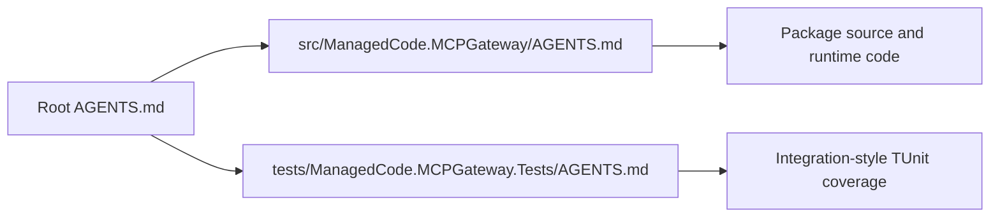
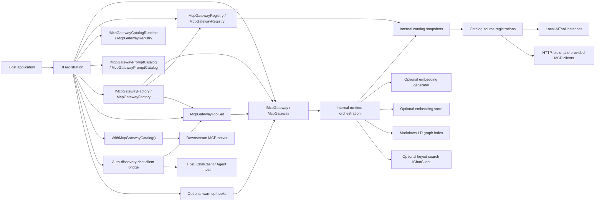
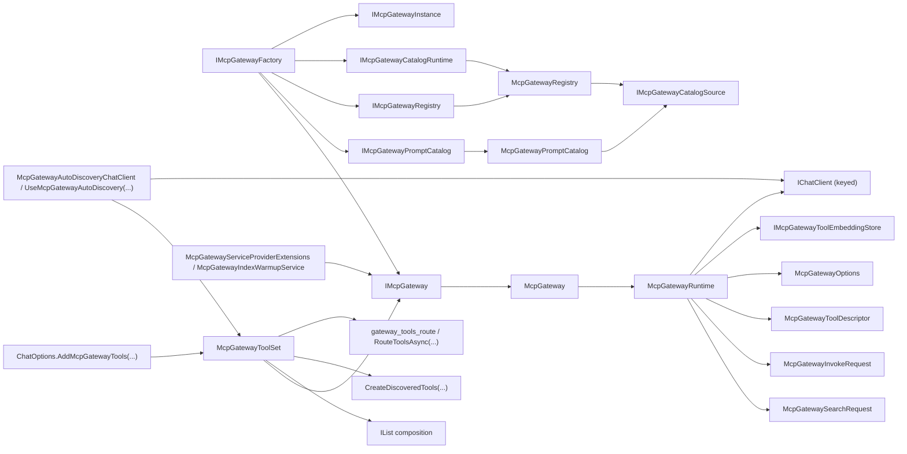
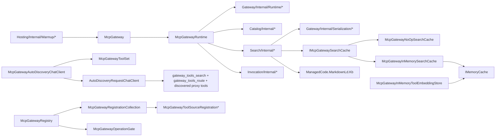

# Architecture Overview

## Scoping (read first)

This document is the module map for `ManagedCode.MCPGateway`.

In scope:

- package boundaries
- runtime collaboration between the public facade, registry, meta-tools, warmup hooks, and internal runtime
- dependency direction between public APIs, internal modules, and optional AI services

Out of scope:

- feature-level ranking metrics
- test corpus details
- CI or release process

## Summary

`ManagedCode.MCPGateway` exposes five public DI surfaces and one reusable tool-set surface:

- `IMcpGateway` for list/search/invoke
- `IMcpGatewayRegistry` for additive catalog registration
- `IMcpGatewayCatalogRuntime` for full in-memory catalog reset and reconfiguration
- `IMcpGatewayPromptCatalog` for aggregated MCP prompt listing and retrieval
- `IMcpGatewayFactory` for isolated custom gateway instances created from host DI
- `McpGatewayToolSet` for reusable search, route, and invoke meta-tools

`McpGateway` stays a thin facade over `McpGatewayRuntime`, which reads immutable catalog snapshots, coordinates default Markdown-LD graph search, vector-first `Auto` search with bounded Markdown-LD supplementation, or explicit embedding-first search, optionally rewrites queries through a keyed `IChatClient`, emits built-in .NET telemetry for build/search operations including vector token usage, calibrates user-facing search confidence before returning matches, and invokes local or MCP tools. Optional startup warmup is available through a service-provider extension or hosted background service without changing the lazy default.

The package also keeps chat-client and agent integration generic: `McpGatewayToolSet` is the source of reusable `AITool` search, route, and invoke meta-tools plus discovered proxy tools, `ChatOptions.AddMcpGatewayTools(...)` remains the low-level bridge, and `McpGatewayAutoDiscoveryChatClient` plus `UseMcpGatewayAutoDiscovery(...)` provide the recommended staged host wrapper that starts with those three gateway tools and replaces the discovered proxy set on each new search result without introducing a hard Agent Framework dependency into the core package.

For MCP interoperability in the other direction, the package also exposes `WithMcpGatewayCatalog()` as a server-builder extension. Hosts can take one aggregated gateway catalog and re-export it as a downstream MCP server that exposes the combined tools and prompts from multiple upstream MCP sources.

The repository now uses feature-first package slices for `Gateway`, `Discovery`, `Catalog`, `Search`, `Invocation`, `Prompts`, and `Hosting`. The durable policy decision behind that structure is captured in [`docs/ADR/ADR-0007-vertical-slice-package-organization.md`](../ADR/ADR-0007-vertical-slice-package-organization.md).

## Governance Map

The solution uses root and project-local `AGENTS.md` files so agents can scope work without scanning the whole repository first.

- Root governance: [`AGENTS.md`](../../AGENTS.md)
- Package project guidance: [`src/ManagedCode.MCPGateway/AGENTS.md`](../../src/ManagedCode.MCPGateway/AGENTS.md)
- Test project guidance: [`tests/ManagedCode.MCPGateway.Tests/AGENTS.md`](../../tests/ManagedCode.MCPGateway.Tests/AGENTS.md)

## System And Module Map

## Interfaces And Contracts

## Key Classes And Types

## Module Index

- Gateway slice: [`src/ManagedCode.MCPGateway/Gateway/`](../../src/ManagedCode.MCPGateway/Gateway/) owns the public facade, factory, instance contracts, options, DI registration, runtime core, telemetry, and shared serialization helpers.
- Discovery slice: [`src/ManagedCode.MCPGateway/Discovery/`](../../src/ManagedCode.MCPGateway/Discovery/) owns reusable meta-tools, category-first routing, discovered-tool projection, auto-discovery chat integration, and discovery-specific registration/configuration.
- Catalog slice: [`src/ManagedCode.MCPGateway/Catalog/`](../../src/ManagedCode.MCPGateway/Catalog/) owns catalog contracts, models, mutable registration state, source adapters, descriptor creation, and index-building logic.
- Search slice: [`src/ManagedCode.MCPGateway/Search/`](../../src/ManagedCode.MCPGateway/Search/) owns search contracts, models, runtime cache/store abstractions, process-local cache/store implementations, query normalization, graph retrieval, vector ranking, and search confidence logic.
- Invocation slice: [`src/ManagedCode.MCPGateway/Invocation/`](../../src/ManagedCode.MCPGateway/Invocation/) owns invocation request/result contracts and runtime execution helpers.
- Prompts slice: [`src/ManagedCode.MCPGateway/Prompts/`](../../src/ManagedCode.MCPGateway/Prompts/) owns prompt contracts and the aggregated prompt catalog implementation.
- Hosting slice: [`src/ManagedCode.MCPGateway/Hosting/`](../../src/ManagedCode.MCPGateway/Hosting/) owns MCP server export and warmup integration.

## Dependency Rules

- Public contracts stay explicit, but each feature slice owns the contracts and internal helpers for its own behavior.
- `Gateway` is the orchestration slice only. It may delegate to catalog, search, invocation, prompts, discovery, and hosting collaborators, but it must not absorb their internal state or transport logic.
- `Catalog` owns mutable source registration state, source adapters, descriptor creation, and index-building orchestration.
- `Search` owns query shaping, ranking, graph retrieval, vector retrieval, confidence calibration, and process-local cache/store implementations.
- `Invocation` owns tool-target resolution, argument preparation, invocation, and result normalization.
- `Prompts` owns prompt listing and prompt retrieval behavior for registered MCP sources.
- `Discovery` owns model-visible gateway tool exposure, category-first routing, and staged auto-discovery chat flow.
- `Hosting` owns downstream MCP server export and optional warmup integration.
- Optional AI services such as embedding generators and query-normalization chat clients must stay outside the package core and be resolved through DI service keys rather than hardwired provider code.
- Chat-client and agent integrations must stay `AITool`-centric in the core package. Host-specific frameworks may consume those tools, but the base package should not take a hard dependency on a specific agent host unless that becomes an explicit product decision.
- `McpGatewayAutoDiscoveryChatClient` may orchestrate tool visibility for host chat loops, but it must stay generic over `IChatClient` and must not take a dependency on Microsoft Agent Framework.
- The recommended staged host flow is: advertise the gateway search, route, and invoke meta-tools first, then project only the latest search matches as direct proxy tools, then replace that discovered set on the next search result.
- Embedding support must stay optional and isolated behind `IMcpGatewayToolEmbeddingStore` and embedding-generator abstractions.
- Process-local runtime search caching must stay behind `IMcpGatewaySearchCache`, with a no-op default and an explicit opt-in `IMemoryCache` implementation for hosts that want local reuse.
- The built-in process-local embedding store may depend on `IMemoryCache`, but cross-instance persistence and cache replication must stay behind host-provided `IMcpGatewayToolEmbeddingStore` implementations.
- Markdown-LD graph search is the default internal retrieval strategy. It may depend on `ManagedCode.MarkdownLd.Kb`, but it must still return the same public `McpGatewaySearchMatch` contracts, calibrate user-facing confidence at the gateway layer, and must not create a separate invocation surface.
- Markdown-LD graph sources may be generated from the live catalog at index build time, loaded from a file-system path, or provided through a host-supplied document factory configured in `McpGatewayOptions`. All modes must still map graph documents back to the current catalog before returning matches.
- Tool metadata used for search enrichment must stay explicit and developer-controlled through registration hints or tool annotations; multilingual improvement should come from metadata plus scoring, not from one-off hardcoded phrase rules in runtime code.
- Warmup remains optional. The package must work correctly with lazy indexing and must not require manual initialization for every host.

## Key Decisions (ADRs)

- [`docs/ADR/ADR-0001-runtime-boundaries-and-index-lifecycle.md`](../ADR/ADR-0001-runtime-boundaries-and-index-lifecycle.md): documents the public/runtime/catalog split, DI boundaries, lazy indexing, cancellation-aware single-flight builds, and optional warmup hooks.
- [`docs/ADR/ADR-0002-search-ranking-and-query-normalization.md`](../ADR/ADR-0002-search-ranking-and-query-normalization.md): documents optional English query normalization and the current search strategy boundaries.
- [`docs/ADR/ADR-0003-reusable-chat-client-and-agent-tool-modules.md`](../ADR/ADR-0003-reusable-chat-client-and-agent-tool-modules.md): documents why chat-client and agent integrations stay generic around reusable `AITool` modules instead of adding a hard Agent Framework dependency to the core package.
- [`docs/ADR/ADR-0004-process-local-embedding-store-uses-imemorycache.md`](../ADR/ADR-0004-process-local-embedding-store-uses-imemorycache.md): documents why the built-in process-local embedding cache uses `IMemoryCache` and why durable/distributed caching remains a host responsibility.
- [`docs/ADR/ADR-0005-markdown-ld-graph-search-for-tool-retrieval.md`](../ADR/ADR-0005-markdown-ld-graph-search-for-tool-retrieval.md): documents the default Markdown-LD graph retrieval path, file-system graph sources, and opt-in vector fallback behavior.
- [`docs/ADR/ADR-0006-vector-first-auto-search-and-runtime-telemetry.md`](../ADR/ADR-0006-vector-first-auto-search-and-runtime-telemetry.md): documents vector-first `Auto`, bounded graph supplementation, runtime telemetry, and performance-smoke coverage.
- [`docs/ADR/ADR-0007-vertical-slice-package-organization.md`](../ADR/ADR-0007-vertical-slice-package-organization.md): documents the feature-first foldering policy and the incremental migration away from large technical buckets.

## Related Docs

- [`README.md`](../../README.md)
- [`docs/ADR/ADR-0001-runtime-boundaries-and-index-lifecycle.md`](../ADR/ADR-0001-runtime-boundaries-and-index-lifecycle.md)
- [`docs/ADR/ADR-0002-search-ranking-and-query-normalization.md`](../ADR/ADR-0002-search-ranking-and-query-normalization.md)
- [`docs/ADR/ADR-0003-reusable-chat-client-and-agent-tool-modules.md`](../ADR/ADR-0003-reusable-chat-client-and-agent-tool-modules.md)
- [`docs/ADR/ADR-0004-process-local-embedding-store-uses-imemorycache.md`](../ADR/ADR-0004-process-local-embedding-store-uses-imemorycache.md)
- [`docs/ADR/ADR-0005-markdown-ld-graph-search-for-tool-retrieval.md`](../ADR/ADR-0005-markdown-ld-graph-search-for-tool-retrieval.md)
- [`docs/ADR/ADR-0006-vector-first-auto-search-and-runtime-telemetry.md`](../ADR/ADR-0006-vector-first-auto-search-and-runtime-telemetry.md)
- [`docs/ADR/ADR-0007-vertical-slice-package-organization.md`](../ADR/ADR-0007-vertical-slice-package-organization.md)
- [`docs/Features/SearchQueryNormalizationAndRanking.md`](../Features/SearchQueryNormalizationAndRanking.md)
- [`docs/Features/AutoVectorFirstSearchAndPerformance.md`](../Features/AutoVectorFirstSearchAndPerformance.md)
- [`AGENTS.md`](../../AGENTS.md)
- [`src/ManagedCode.MCPGateway/AGENTS.md`](../../src/ManagedCode.MCPGateway/AGENTS.md)
- [`tests/ManagedCode.MCPGateway.Tests/AGENTS.md`](../../tests/ManagedCode.MCPGateway.Tests/AGENTS.md)
