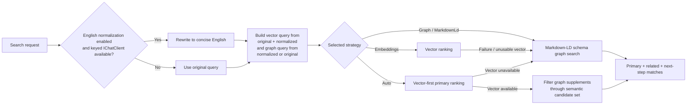

# Auto Vector-First Search And Performance

## Purpose And Scope

This feature fixes multilingual, typo-heavy, and weakly specified tool retrieval in `ManagedCode.MCPGateway` when hosts choose `McpGatewaySearchStrategy.Auto`.

In scope:

- vector-first primary ranking for `Auto` when embeddings are available
- Markdown-LD schema graph supplementation after vector ranking
- graph-only fallback when query embeddings are unavailable or unusable
- preserving both the original query and the English-normalized query for vector retrieval
- using the normalized English query for graph retrieval when normalization changes the request
- progressive auto-discovery that can expose vector primary tools plus graph-driven related or next-step tools
- built-in runtime telemetry for search and index operations through .NET diagnostics, including vector token usage
- deterministic performance regression coverage plus full BenchmarkDotNet benchmarks

Out of scope:

- changing the default `Graph` strategy
- introducing a new public BM25 or tokenizer strategy; ranked candidate/fuzzy support stays internal to the Markdown-LD graph path
- tool quarantine, moderation, or remote policy enforcement
- agent-to-agent protocol support

## Affected Modules

- `src/ManagedCode.MCPGateway/Search/Internal/Ranking/*`
- `src/ManagedCode.MCPGateway/Search/Internal/Graph/*`
- `src/ManagedCode.MCPGateway/Gateway/Internal/Telemetry/*`
- `src/ManagedCode.MCPGateway/Search/Models/*`
- `src/ManagedCode.MCPGateway/Discovery/McpGatewayAutoDiscoveryChatClient.cs`
- `tests/ManagedCode.MCPGateway.Tests/Search/*`
- `tests/ManagedCode.MCPGateway.Tests/Discovery/ChatClient/*`
- `README.md`

## Business Rules

1. `SearchStrategy.Graph` remains the default no-embedding retrieval mode.
2. `SearchStrategy.Auto` must use vector ranking first when query embeddings are available.
3. `SearchStrategy.Auto` must not let graph ranking override the semantic primary result order for multilingual or noisy queries before vector ranking runs.
4. `SearchStrategy.Auto` may use Markdown-LD schema graph results only after vector ranking succeeds, to enrich primary confidence and to supply related or next-step matches.
5. `SearchStrategy.Auto` must fall back to Markdown-LD graph ranking when query embeddings are unavailable, fail, or return an unusable vector.
6. When English normalization changes the query, vector search must preserve both the original query and the normalized English query so multilingual embedding models do not lose original-language evidence.
7. When English normalization changes the query, graph search should prefer the normalized English query so schema-aware graph retrieval converges on the searchable English representation.
8. Graph supplementation in `Auto` must stay semantically bounded: graph-only supplements should not flood the result set with tools that were not competitive in the vector candidate set, and large catalogs must not pay unbounded schema/graph supplement cost after a usable vector primary result.
9. Auto-discovery must continue to expose a small direct tool set: two meta-tools first, then the latest discovered proxy tools from primary plus supplemental graph matches.
10. Search and index operations must emit built-in .NET telemetry so hosts can observe duration, selected ranking behavior, and vector token cost without extra dependencies.
11. Performance coverage must include deterministic regression tests over a larger catalog plus full BenchmarkDotNet benchmark coverage so the vector-first pipeline does not regress into repeated index rebuilds or unbounded query work.

## Main Flow

## Negative And Edge Cases

- Empty query with no context still returns `browse`.
- Empty catalog still returns `empty`.
- If normalization is enabled but no keyed normalizer client exists, the original query remains usable for vector and graph search.
- If normalization fails, search still completes with the original query.
- If query embeddings are unavailable in `Auto`, graph ranking is used without throwing.
- If graph search is unavailable in `Auto`, vector search may still return primary results without failing the request.
- Multilingual graph noise must not displace a semantically strong vector primary result in `Auto`.
- Graph supplements that are absent from the semantic candidate window must not be surfaced as direct auto-discovery tools.

## System Behavior

- Entry points:
  - `IMcpGateway.SearchAsync(...)`
  - `McpGatewayToolSet.SearchAsync(...)`
  - `McpGatewayAutoDiscoveryChatClient`
- Reads:
  - optional keyed search normalizer chat client
  - optional embedding generator and optional embedding store
  - generated or file-backed Markdown-LD graph
- Writes:
  - no new persistent state beyond the existing optional embedding store
  - optional process-local cache entries through `IMcpGatewaySearchCache` for normalized queries, query embeddings, and repeated search results
  - telemetry through `ActivitySource` and `Meter`
- Side effects:
  - one optional query-normalization chat request per unique query until the process-local cache entry expires
  - one optional query embedding generation request per unique vector query until the process-local cache entry expires
  - one optional graph search pass per cache miss
- Errors:
  - search must remain diagnostic-driven instead of throwing for optional normalizer, graph, or vector failures

## Verification

Environment assumptions:

- .NET 10 SDK from `global.json`
- `TUnit` on `Microsoft.Testing.Platform`

Verification commands:

- `dotnet tool restore`
- `dotnet restore ManagedCode.MCPGateway.slnx`
- `dotnet build ManagedCode.MCPGateway.slnx -c Release --no-restore`
- `dotnet test --solution ManagedCode.MCPGateway.slnx -c Release --no-build`

Test mapping:

- vector-first auto regression coverage in `tests/ManagedCode.MCPGateway.Tests/Search/Auto/McpGatewaySearchAutoTests.cs`
- multilingual auto coverage in `tests/ManagedCode.MCPGateway.Tests/Search/*`
- auto-discovery projection coverage in `tests/ManagedCode.MCPGateway.Tests/Discovery/ChatClient/*`
- telemetry coverage in `tests/ManagedCode.MCPGateway.Tests/Search/*`
- runtime cache coverage in `tests/ManagedCode.MCPGateway.Tests/Search/*`
- deterministic performance regression coverage in `tests/ManagedCode.MCPGateway.Tests/Search/*`
- BenchmarkDotNet search, index-build, and meta-tool allocation coverage in `benchmarks/ManagedCode.MCPGateway.Benchmarks/`

## Definition Of Done

- `Auto` runs vector first when vectors are available
- graph supplements are added only after vector ranking and stay semantically bounded
- multilingual queries can benefit from both original-language and normalized-English vector input
- graph fallback still works when vectors are unavailable
- auto-discovery continues to expose focused discovered tool sets
- runtime search and index telemetry is emitted through built-in .NET diagnostics
- regression tests and full BenchmarkDotNet benchmarks cover the shipped behavior
- BenchmarkDotNet benchmarks exist for representative search, index-build, and meta-tool hot paths with allocation statistics
- docs describe the real `Auto` behavior instead of the older graph-first policy

## Related Docs

- [`README.md`](../../README.md)
- [`docs/Performance/Benchmarks.md`](../Performance/Benchmarks.md)
- [`docs/Architecture/Overview.md`](../Architecture/Overview.md)
- [`docs/ADR/ADR-0002-search-ranking-and-query-normalization.md`](../ADR/ADR-0002-search-ranking-and-query-normalization.md)
- [`docs/ADR/ADR-0005-markdown-ld-graph-search-for-tool-retrieval.md`](../ADR/ADR-0005-markdown-ld-graph-search-for-tool-retrieval.md)
- [`docs/ADR/ADR-0012-schema-aware-sparql-graph-search.md`](../ADR/ADR-0012-schema-aware-sparql-graph-search.md)

## Implementation Plan

1. Refactor search input shaping so vector and graph stages can use different query text.
2. Replace graph-first `Auto` with vector-first primary ranking plus graph supplementation.
3. Keep graph fallback behavior intact for zero-vector or failed-vector scenarios.
4. Add built-in search and index telemetry using .NET diagnostics.
5. Extend tests for multilingual auto behavior, graph supplementation, telemetry, and deterministic performance regression coverage.
6. Update `README.md`, ADRs, and the architecture overview.
