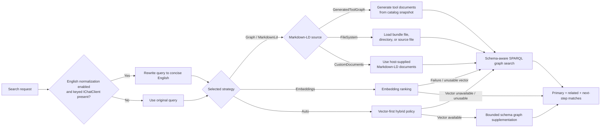

# Search Query Normalization And Ranking

## Purpose And Scope

This feature improves `ManagedCode.MCPGateway` search quality for multilingual, typo-heavy, and weakly specified search requests without introducing phrase-level hardcoded rules or a mandatory embedding dependency.

In scope:

- optional English query normalization before ranking
- Markdown-LD schema-aware SPARQL graph ranking as the default search path
- explicit schema/profile inspection, schema-aware graph search, federated SPARQL search, graph evidence, and graph export through `IMcpGatewayGraphSearch`
- opt-in vector ranking with graph fallback
- vector-first `Auto` ranking with bounded Markdown-LD schema graph supplementation
- explicit tool search hints for aliases and keywords
- gateway-level confidence calibration for graph-ranked results
- file-system Markdown-LD graph sources for pre-generated graph documents
- host-supplied Markdown-LD graph documents for explicit index-input control
- deterministic behavior when no AI normalizer or embedding generator is registered
- automated verification for graph, vector fallback, multilingual, noisy, and focused expansion scenarios

Out of scope:

- embedding model changes
- vendor-specific AI SDK setup inside the package
- domain-specific synonym lists or handcrafted query exceptions
- exposing a separate local tokenizer strategy

## Affected Modules

- `src/ManagedCode.MCPGateway/Gateway/Configuration/McpGatewayOptions.cs`
- `src/ManagedCode.MCPGateway/Search/Models/*`
- `src/ManagedCode.MCPGateway/Search/Abstractions/IMcpGatewayGraphSearch.cs`
- `src/ManagedCode.MCPGateway/Search/Internal/Graph/*`
- `src/ManagedCode.MCPGateway/Search/Internal/Ranking/*`
- `tests/ManagedCode.MCPGateway.Tests/Search/*`
- `README.md`

## Business Rules

1. Graph-backed search must be the default and must stay functional with zero embedding or chat-model dependencies.
2. Embedding search must be opt-in and must fall back to Markdown-LD graph ranking when vector search cannot complete.
3. `Auto` may exist as an explicit policy mode, but it must not be documented as the default or as a third retrieval engine.
4. `Auto` must run vector ranking first when vectors are available and usable, then use Markdown-LD graph search only for bounded related or next-step supplementation.
5. Graph mode must use `ManagedCode.MarkdownLd.Kb` schema-aware SPARQL search as the primary path when `MarkdownLdGraphSearchMode` is `Hybrid` or `SchemaAware`.
6. Hybrid graph mode may use `ManagedCode.MarkdownLd.Kb` ranked BM25 and fuzzy token matching only as support or fallback on focused catalogs; larger catalogs must avoid unbounded BM25 passes and use schema or token-distance graph behavior instead.
7. Token-based retrieval must come from `ManagedCode.MarkdownLd.Kb` inside the graph path; the package must not expose a separate local `Tokenizer` strategy.
8. Markdown-LD graph mode must support generated tool documents at index build/startup and file-system graph sources through a configured path.
9. Markdown-LD graph mode should also allow host-supplied Markdown-LD documents so developers can control graph authoring without replacing the gateway runtime.
10. File-backed graph tests must generate graph fixtures through package APIs or generated Markdown-LD documents, not hand-authored static artifacts.
11. Federated SPARQL graph search must be explicit and allowlisted through configured service endpoints.
12. Graph schema/profile inspection, evidence, generated SPARQL, federated service metadata, and runtime graph export must live on `IMcpGatewayGraphSearch`, not on `IMcpGateway`.
13. Built-in graph tools must include schema/profile inspection and explicit index-build tools so chat agents can inspect and rebuild the current tool graph before relying on graph retrieval.
14. When query normalization is enabled and a keyed `IChatClient` is available, the gateway must normalize the user query into concise English before ranking.
15. Query normalization must preserve identifiers and retrieval-critical literals such as emails, repository names, CVE references, order numbers, tracking numbers, and SKUs.
16. If normalization is enabled but no keyed normalizer client is registered, the gateway must continue with the original query and must not fail the search.
17. If normalization fails, the gateway must continue with the original query and expose a diagnostic rather than throwing.
18. Search-quality improvements must prefer mathematical or graph-ranking changes over text-level hardcoded exceptions.
19. Gateway-facing `McpGatewaySearchMatch.Score` values must be calibrated confidence values rather than raw graph-library ranks, because callers need trustworthy confidence for multilingual and noisy queries.
20. Low-confidence graph results must emit a diagnostic instead of surfacing fake perfect confidence.
21. Developers must be able to attach explicit aliases and keywords to tools so multilingual and product-specific discovery can improve without adding hardcoded ranking exceptions.
22. Default search result limits and existing public search/invoke entry points must remain intact.

## Main Flow

## Negative And Edge Cases

- Empty query with no context still returns `browse` mode.
- Empty catalog still returns `empty` mode.
- Default graph mode must not call a registered embedding generator.
- Forced graph mode must build or load the graph during explicit init, lazy first use, or hosted warmup.
- Missing file-system graph path must be reported as a diagnostic and must not crash list/search/invoke.
- A registered embedding generator is used only when the selected strategy allows vector search.
- `Auto` must not let graph-only noise override a strong semantic primary result.
- A normalization client that returns blank output must not replace the original query.
- A normalization client that times out or throws must emit a diagnostic and fall back to the original query.
- Typo-heavy inputs such as `shipmnt` must still retrieve the expected tool through Markdown-LD hybrid graph search.
- Direct graph search must return generated SPARQL, graph evidence, and mapped gateway tool matches.
- Direct graph schema/profile inspection must return prefixes, predicates, graph counts, and diagnostics.
- Built-in graph tools must expose schema/profile inspection and explicit index rebuild behavior.
- Federated graph search must reject unconfigured endpoints with diagnostics instead of sending hidden remote requests.
- Clearly irrelevant multilingual or noisy graph matches must not surface with `Score = 1`.

## System Behavior

- Entry points:
  - `IMcpGateway.SearchAsync(string?, int?, CancellationToken)`
  - `IMcpGateway.SearchAsync(McpGatewaySearchRequest, CancellationToken)`
  - `IMcpGatewayGraphSearch.DescribeGraphSchemaAsync(CancellationToken)`
  - `IMcpGatewayGraphSearch.SearchGraphAsync(McpGatewayGraphSearchRequest, CancellationToken)`
  - `IMcpGatewayGraphSearch.ExportMarkdownLdGraphAsync(CancellationToken)`
- Reads:
  - tool catalog snapshot from `IMcpGatewayCatalogSource`
  - optional tool search hints from local registration metadata or tool annotations/additional properties
  - keyed optional search normalizer client from DI
  - optional embedding generator and embedding store from DI when vector strategy is selected
  - search and graph-source options from `McpGatewayOptions`
  - schema-aware graph search mode and federated endpoint allowlist from `McpGatewayOptions`
  - file-system Markdown-LD graph source when `MarkdownLdGraphSource.FileSystem` is selected
  - host-supplied Markdown-LD graph documents when `UseMarkdownLdGraphDocuments(...)` is selected
- Writes:
  - no persistent writes beyond existing optional embedding-store behavior
  - optional process-local cache entries through `IMcpGatewaySearchCache` for normalized queries, query embeddings, and repeated search results
- graph bundle authoring uses `McpGatewayMarkdownLdGraphFile.WriteAsync(...)` when the host chooses to generate a file
- built-in `gateway_tool_index_build` calls the same explicit `BuildIndexAsync(...)` runtime path used by manual host initialization
- Side effects:
  - optional `IChatClient` request for query normalization per unique query until the process-local cache entry expires
  - in-memory Markdown-LD graph construction during index build for graph-capable strategies
  - optional allowlisted federated SPARQL execution when explicitly requested
  - optional query embedding generation per unique vector query until the process-local cache entry expires
  - diagnostics describing normalization fallback, vector fallback, graph-source problems, or low-confidence graph conditions
- Idempotency:
  - same indexed catalog, same graph source, and same deterministic query-normalizer response yield stable ranking
- Errors:
  - search must not throw only because the optional normalizer is missing or fails
  - graph build failures must be diagnostic-only

## Verification

Environment assumptions:

- .NET 10 SDK from `global.json`
- `TUnit` on `Microsoft.Testing.Platform`

Verification commands:

- `dotnet restore ManagedCode.MCPGateway.slnx`
- `dotnet build ManagedCode.MCPGateway.slnx -c Release --no-restore`
- `dotnet build ManagedCode.MCPGateway.slnx -c Release --no-restore -p:RunAnalyzers=true`
- `dotnet test --solution ManagedCode.MCPGateway.slnx -c Release --no-build`

Test mapping:

- normalization success and fallback behavior in `tests/ManagedCode.MCPGateway.Tests/Search/Graph/McpGatewaySearchMarkdownLdTests.cs`
- explicit search-hint coverage in `tests/ManagedCode.MCPGateway.Tests/Search/Graph/McpGatewaySearchMarkdownLdTests.cs`
- generated graph ranking coverage in `tests/ManagedCode.MCPGateway.Tests/Search/Graph/McpGatewaySearchGraphTests.cs`
- schema-aware SPARQL graph search coverage in `tests/ManagedCode.MCPGateway.Tests/Search/Graph/McpGatewaySearchGraphSparqlTests.cs`
- schema/profile inspection coverage in `tests/ManagedCode.MCPGateway.Tests/Search/Graph/McpGatewaySearchGraphSparqlTests.cs`
- federated local graph search coverage in `tests/ManagedCode.MCPGateway.Tests/Search/Graph/McpGatewaySearchGraphSparqlTests.cs`
- blocked federated endpoint diagnostics coverage in `tests/ManagedCode.MCPGateway.Tests/Search/Graph/McpGatewaySearchGraphSparqlTests.cs`
- file-backed graph bundle and directory coverage in `tests/ManagedCode.MCPGateway.Tests/Search/Graph/McpGatewaySearchGraphTests.cs`
- embedding fallback coverage in `tests/ManagedCode.MCPGateway.Tests/Search/Graph/McpGatewaySearchMarkdownLdTests.cs`
- default graph/no-embedding coverage in `tests/ManagedCode.MCPGateway.Tests/Catalog/Indexing/McpGatewaySearchBuildTests.cs`
- confidence calibration coverage in `tests/ManagedCode.MCPGateway.Tests/Search/Confidence/McpGatewaySearchConfidenceTests.cs`
- `Auto` vector-first and graph-supplement coverage in `tests/ManagedCode.MCPGateway.Tests/Search/Auto/McpGatewaySearchAutoTests.cs`
- telemetry coverage in `tests/ManagedCode.MCPGateway.Tests/Search/McpGatewayTelemetryTests.cs`
- deterministic performance regression coverage in `tests/ManagedCode.MCPGateway.Tests/Search/Performance/McpGatewaySearchPerformanceTests.cs`
- auto-discovery graph expansion coverage in `tests/ManagedCode.MCPGateway.Tests/Discovery/ChatClient/` and `tests/ManagedCode.MCPGateway.Tests/Discovery/Agents/`
- graph schema/profile, index-build, search, federation, and export meta-tool coverage in `tests/ManagedCode.MCPGateway.Tests/Discovery/MetaTools/McpGatewayGraphMetaToolTests.cs`
- BenchmarkDotNet search, index-build, and meta-tool allocation coverage in `benchmarks/ManagedCode.MCPGateway.Benchmarks/`

## Definition Of Done

- graph-backed search is the default no-embedding path
- schema-aware SPARQL is the primary graph retrieval path in the default hybrid graph mode
- explicit federated SPARQL graph search is covered by automated tests
- graph schema/profile, evidence, generated SPARQL, and graph export are exposed through `IMcpGatewayGraphSearch`
- built-in graph tools expose schema/profile inspection, explicit index rebuilds, schema-aware search, federated search, and export
- graph mode supports generated startup/index-build documents and file-system graph sources
- vector ranking is opt-in and falls back to graph ranking on query vector failure
- `Auto` uses vector-first ranking, preserves semantic primary ordering, and returns `hybrid` when graph supplementation contributes expansion matches
- optional English query normalization works through `Microsoft.Extensions.AI`
- tool search hints can enrich multilingual and domain-specific discovery
- multilingual, typo-heavy, focused expansion, and file-backed graph scenarios are covered by automated tests
- runtime telemetry is emitted through built-in .NET diagnostics
- BenchmarkDotNet benchmarks cover representative graph search, index-build, and meta-tool hot paths with allocation statistics
- docs explain how to configure graph, file-backed graph, embeddings, and optional query normalization
- build, analyzers, and tests stay green

## Related Docs

- [`README.md`](../../README.md)
- [`docs/ADR/ADR-0002-search-ranking-and-query-normalization.md`](../ADR/ADR-0002-search-ranking-and-query-normalization.md)
- [`docs/ADR/ADR-0005-markdown-ld-graph-search-for-tool-retrieval.md`](../ADR/ADR-0005-markdown-ld-graph-search-for-tool-retrieval.md)
- [`docs/ADR/ADR-0012-schema-aware-sparql-graph-search.md`](../ADR/ADR-0012-schema-aware-sparql-graph-search.md)
- [`docs/ADR/ADR-0001-runtime-boundaries-and-index-lifecycle.md`](../ADR/ADR-0001-runtime-boundaries-and-index-lifecycle.md)
- [`docs/Architecture/Overview.md`](../Architecture/Overview.md)
- [`docs/Performance/Benchmarks.md`](../Performance/Benchmarks.md)

## Implementation Plan

1. Keep search-normalization configuration in `McpGatewayOptions` and a keyed DI service key for the optional normalizer chat client.
2. Keep normalization in the search pipeline with graceful fallback and diagnostics.
3. Use `ManagedCode.MarkdownLd.Kb` as the Markdown-LD graph, schema-aware SPARQL, federated SPARQL, ranked BM25/fuzzy, and token-distance search implementation.
4. Support generated and file-system graph sources in the runtime graph index.
5. Keep deterministic tests for query normalization, generated graph, schema SPARQL, federated graph search, file-backed graph, vector fallback, vector-first auto supplementation, telemetry, and performance regression coverage.
6. Update `README.md` with configuration, telemetry, and operational guidance.
